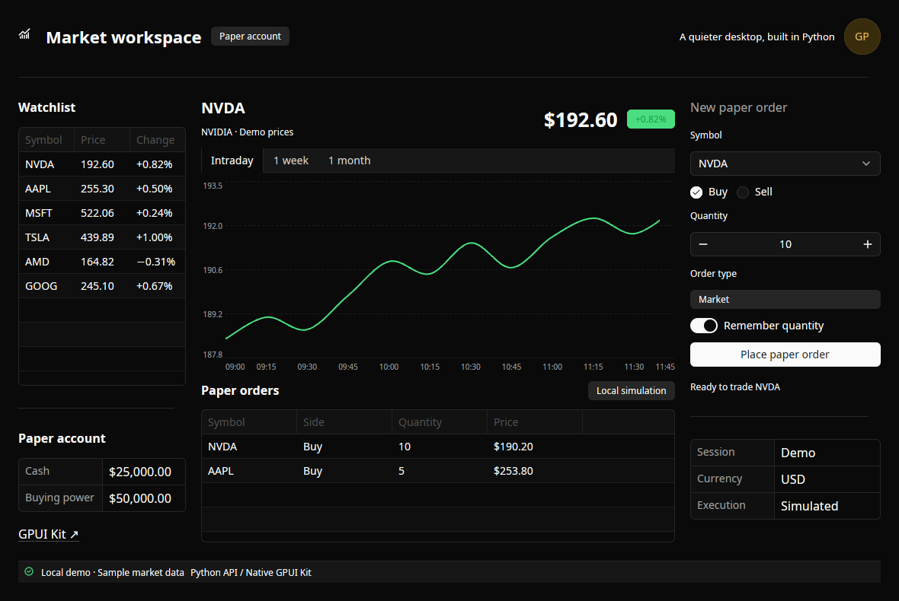
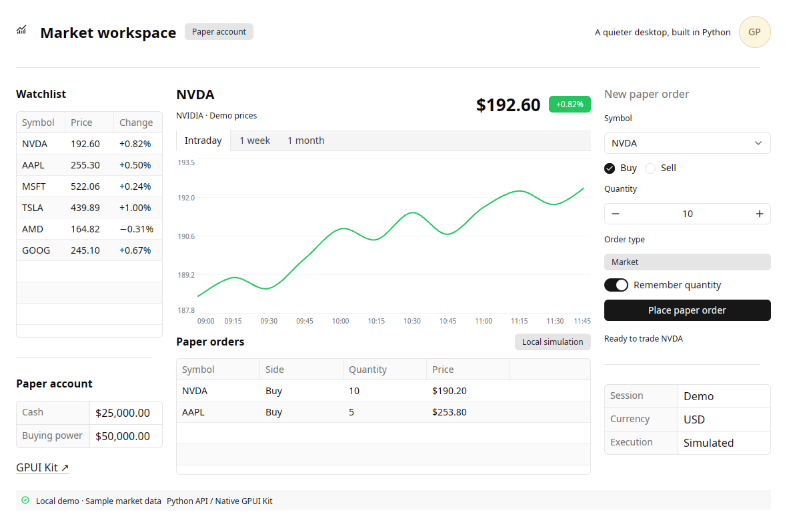

# gpyui

A native Python UI library powered by [GPUI](https://www.gpui.rs/)
([source](https://github.com/zed-industries/zed/tree/main/crates/gpui)) and
Longbridge's [GPUI Kit](https://gpui-kit.com/)
([source](https://github.com/longbridge/gpui-kit)), with a
PyO3/maturin extension. Rust owns windows, rendering, focus and text editing;
Python owns composition, application state and callbacks.

The goal is a reusable desktop UI toolkit: write complete applications in Python,
as you would with Tkinter, using GPUI Kit components through Python controls.
Application authors should not need to write Rust. There are now **71 Python
controls**, including native Kit inputs, navigation, tables, charts, overlays,
rich text and feedback components. These are initial wrappers for the catalog;
[component coverage](docs/component-coverage.md) records the supported properties
and the specialized Kit APIs still to expose.

`gpyui` is a working name. Package-name availability has not been checked.

## Documentation

The [Zensical documentation](https://gtrefalt.github.io/gpyui/) includes guides, API references and
a [visual catalog of all 71 controls](https://gtrefalt.github.io/gpyui/components/), each with a real
native preview, properties, events and a runnable Python example.

Preview it without building the Rust extension:

```bash
UV_PROJECT_ENVIRONMENT=.venv-docs uv sync --locked --only-group docs
UV_PROJECT_ENVIRONMENT=.venv-docs uv run --locked --only-group docs zensical serve
```

Open `http://localhost:8000`. See [documentation development](docs/contributing-docs.md)
for strict builds, generated-reference checks, native captures and optional Pages
publication. Pull requests include a built HTML preview artifact.

```python
from gpyui import Application, Button, Column, Label, TextInput

app = Application(title="Hello")
with app, Column():
    Label("Name")
    name = TextInput(placeholder="Enter your name")
    greeting = Label("Enter a name and choose Greet")
    Button("Greet", on_click=lambda: setattr(greeting, "text", f"Hello, {name.value or 'world'}!"))

app.run()
```

Explicit composition also works: `Application(Column([Label("Hello"), ...]))`.
See [examples/async_binding.py](examples/async_binding.py) for `State`, two-way
input binding and an async callback.

## Native trading demo

The [paper-trading workspace](examples/workspace.py) is a simpler desktop example
inspired by a multi-pane trading terminal. A seeded, local stream updates the
watchlist, price, percentage change, rolling chart and market tape every 650 ms.
Its native button runs an async Python callback and fills a paper order at the
current simulated price. The animation shows Buy/Sell orders and switching to
AAPL while quotes continue updating. The
[component gallery](examples/gallery.py) demonstrates the reusable controls.
These are captures of the actual GPUI windows, rendered on Linux with Xvfb and
Mesa Lavapipe.


The 12-second GIF records the actual native window at 10 fps. All data and trades
are simulated locally; the example makes no broker connections.

<details>
<summary>Still screenshots and component gallery</summary>






</details>

```bash
uv run python examples/workspace.py --theme dark
uv run python examples/workspace.py --theme light
uv run python examples/workspace.py --static  # freeze prices
uv run python examples/gallery.py
```

To regenerate the GIF on Linux, install Xvfb, xdotool and FFmpeg, then run:

```bash
uv run python scripts/record-workspace.py
```

The recorder starts a free Xvfb display when needed, activates controls with real
mouse/keyboard events, captures the native window and verifies the resulting
orders and clean shutdown. Temporary video, logs and snapshots go to `artifacts/`.

## Compose and bind Kit controls

```python
from gpyui import Application, Checkbox, Column, Label, Slider, State

enabled = State(True)
app = Application(title="Settings", theme="dark")
with app, Column().style(gap=16):
    Checkbox("Enable notifications").bind_value(enabled)
    Label().bind_text(enabled, lambda value: "Enabled" if value else "Disabled")
    volume = Slider(35, on_change=lambda event: print(event.value))
app.run()
```

Use `with Row():`, `GroupBox("Title")`, `Scroll()` and `Resizable(children=[...])`
for composition. `.style(...)` accepts pixel dimensions and spacing plus semantic
theme colors, such as `color="muted_foreground"`. `Application(theme="light")`
and `Application(theme="dark")` choose the initial native theme. Mutable collection
properties, such as `Table.rows` and `LineChart.data`, update through assignment;
their getters return copies. See [the coverage and API guide](docs/component-coverage.md).

## Build and run

The [Build wheels workflow](https://github.com/gtrefalt/gpyui/actions/workflows/release.yml)
builds six wheels for Linux, macOS and Windows on x86_64 and ARM64, plus a source
archive, and tests the installed packages on Python 3.12–3.14. The
[GitHub release](https://github.com/gtrefalt/gpyui/releases) provides every wheel.
Optional PyPI Trusted Publishing uploads the macOS/Windows wheels and source
archive; Linux wheels remain on GitHub because PyPI rejects their current tags.
A manual workflow can publish a matching version tag after building and testing,
or reuse a previously tested release with checksum verification.
See [wheels and release setup](docs/releases.md).

Python 3.12+ and the pinned Rust toolchain are required. Native Linux builds need
development packages for X11/XCB, xkbcommon, Wayland, fontconfig, FreeType and a
Vulkan driver. Typical Debian packages:

```bash
sudo apt-get install build-essential pkg-config libclang-dev libfontconfig-dev \
  libfreetype-dev libx11-dev libx11-xcb-dev libxcb1-dev libxcb-xkb-dev \
  libxkbcommon-dev libxkbcommon-x11-dev libwayland-dev libvulkan-dev \
  mesa-vulkan-drivers
uv sync --locked
uv run python examples/hello.py
uv run python examples/async_binding.py
```

The generated project started with `uv init --lib --build-backend maturin --vcs
git /workspace/glint`, then was renamed at the user's request. The initial
uv_build scaffold was preserved separately before reinitialization.

In **this cloud workspace**, the toolchain and Debian packages were installed
locally without root access. Use:

```bash
cd /workspace/gpyui
source scripts/workspace-env.sh
uv sync --locked
uv run python examples/hello.py  # requires an actual display
```

## Callback and update contract

* `run()` owns the main-thread native event loop and blocks until close. One
  native run per process, one window, static mounted tree in this milestone.
* Callbacks execute on the `gpyui-asyncio` worker thread. A callback may require
  zero arguments or one `Event`. Handlers with no required arguments are called
  without an event. Both async handlers and returned awaitables are supported.
* Keep synchronous handlers short. Use `await asyncio.to_thread(...)` for
  blocking work; marshal UI mutations back to the callback loop. `app.call_soon`
  provides this handoff for other threads. Existing main-thread asyncio loops
  cannot host `run()` yet.
* Property assignments automatically coalesce by control/property per asyncio
  turn. `with app.batch(): ...` groups synchronous assignments. `app.update()`
  flushes immediately; neither is a rollback transaction.
* `await app.snapshot()` flushes and returns applied native properties, indexed
  by control ID. This is a command barrier, not a GPU presentation fence.
* Rust interactions update Python control `.value` and any bound `State` before
  `on_change`. Button activation carries a current value snapshot, so a handler
  reading `name.value` sees the input at activation. Native edits never pass
  through Rust `set_value`, preserving native cursor/selection/undo.
* Assigning `TextInput.value` deliberately replaces the editing buffer and clears
  undo history, following upstream `InputState.set_value`. It emits no user
  change callback. `.value` elsewhere is an asynchronously received mirror;
  use a snapshot when authoritative native state is needed.
* `State` uses explicit observers and equality guards. `Label.bind_text(state)`
  binds one way; input/selection controls' `.bind_value(state)` binds both ways. `unbind()` removes
  subscriptions. Mutate bound state on the callback loop while running.
* `app.close()` requests shutdown. Native window close cancels awaiting handlers,
  gathers tasks, closes the asyncio loop, joins its worker, and unbinds controls.
  Cooperative cancellation cannot terminate an indefinitely blocking sync handler.
* Callback exceptions go to `on_error(exception)` or asyncio's exception handler
  and remain available in `app.errors`. Queue overload is explicit, not silent.
* `Dialog` and `Sheet` own Python-composed contents; `.open()` and `.close()`
  queue native overlay operations. One of each per window is currently supported.
  `app.notify(message, title="...", variant="success")` shows a native Kit toast.

## Validation

The [Justfile](justfile) provides development commands, and
[Lefthook](lefthook.yml) runs Ruff lint/format checks and ty on commit, then all
Python checks before push. Tool versions are pinned in `uv.lock`. Set up once:

```bash
uv tool install rust-just==1.58.0
just hooks
```

`just hooks` installs tools into `.venv-tools` and installs the Git hooks. The
checks do not build the native extension or replace the native `.venv`:

```bash
just check          # Ruff lint, formatting and ty across src/examples/scripts/tests
just format         # safe Ruff fixes and formatting
just typecheck      # ty only
just test           # Python and Rust bridge tests; native build prerequisites needed
just test-native    # actual native-window interaction tests
just rust-check     # cargo fmt and clippy
just docs-check     # generated references, strict docs build and link checks
just --list         # all available commands
```

Ruff checks staged Python files before commit. ty checks the entire Python tree
when Python code or project configuration changes. Hooks report failures without
modifying or restaging files. CI runs `just check` on every PR and main-branch push
using a tools-only environment.

Equivalent direct commands for native verification:

```bash
uv run pytest -q
cargo check --locked
cargo clippy --locked -- -D warnings
cargo fmt --check
```

For actual native-window interaction tests, install Xvfb, xdotool and optionally
ImageMagick, then run `scripts/test-native.sh`. The script uses a free virtual
display and the local Mesa driver in this workspace. It tests native text input,
pointer and keyboard button activation, Python label updates, async binding,
exceptions, close/cancellation, catalog rendering, light/dark workspaces, paper
orders and native dialog/sheet dismissal. Logs, screenshots and native snapshots go to
`artifacts/` (gitignored). Tests otherwise skip explicitly when native testing
is not enabled.

Read [docs/architecture.md](docs/architecture.md) for the source-grounded
NiceGUI/Flet comparison, design decisions and implementation plan,
[docs/upstream-lock.json](docs/upstream-lock.json) for revisions, and
[docs/validation.md](docs/validation.md) for measured results and limits.

Linux/X11 has native interaction tests. The [wheel workflow](docs/releases.md) covers
Linux, Windows and macOS on x64 and ARM64; Windows/macOS use native window smoke tests.
Wayland, multiwindow,
dynamic topology, large control sets and additional wheel platforms remain follow-on
work. This prototype does not claim complete Kit API coverage or production readiness.
