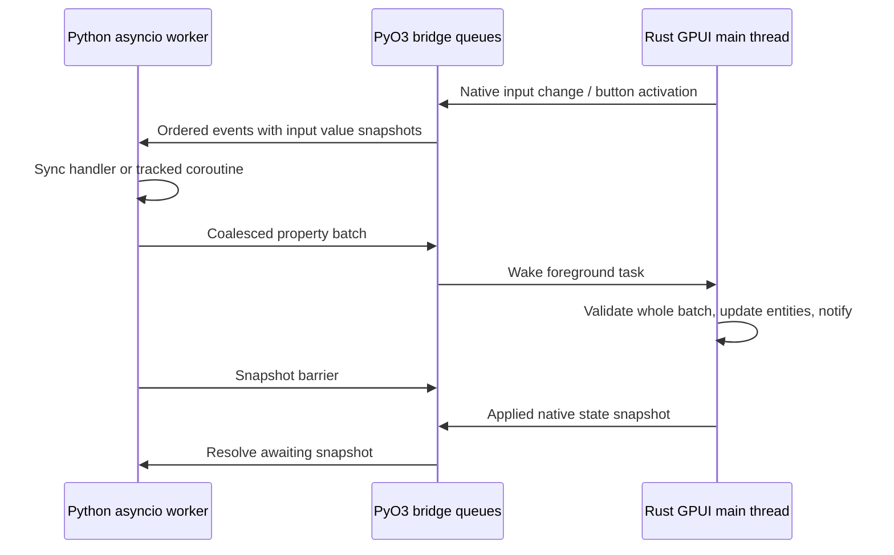

# gpyui architecture and first milestone

Status: source inspection completed before implementation, 2026-10-01.
`gpyui` replaces the working name Glint. Package-name availability has **not**
been checked. This is a desktop library, not a server, browser, or Flutter client.

## Product goal

gpyui exposes Longbridge's GPUI Kit components through a reusable Python API so
developers can write complete native desktop applications entirely in Python,
comparable in use to Tkinter and other Python UI toolkits. Rust is the internal
implementation of native rendering, component state, text editing and windows;
application authors compose controls and implement application behavior in Python.

The four-control milestone proves this bridge. It is the beginning of the
toolkit, not its intended final component set. Subsequent work should extend
actual GPUI Kit component coverage and make layout, styling, events, state and
application lifecycle accessible through Python. Document implemented capabilities
separately from planned coverage, and verify each wrapper against pinned sources.

## Reproducible upstream baseline

All four repositories were cloned into `/workspace/upstream`. Exact inspected
revisions are recorded in [upstream-lock.json](upstream-lock.json).

* GPUI Kit: `3a142844d3661159964dce9e5512ca9a40286160` (0.7.0).
* Zed/GPUI: `1a28cff4b409169bac058bca40dfbfeb7621d19b`.
* NiceGUI: `d0323a34fd87c51323e4fda60f6805d6fe8e329d`.
* Flet: `0ec63ca849386be77831241f21b82a0cc8c13942`.

Zed was initially cloned at `95cd535a5fad96d649513f96c5784ceefd379e47`.
GPUI Kit's workspace manifest pins the `gpui-pre-*` family to **exactly 0.3.7**.
The downloaded GPUI manifest's `[package.metadata.gpui-pre]` identifies the Zed
revision above. We fetched and checked out that revision to verify the actual
runtime being consumed. Do not add a second, git-head GPUI dependency: its types
would differ from Kit's. Depend on the pinned `gpui-kit` git revision and use its
facade. `Cargo.lock` pins registry versions, checksums, and git sources; the Rust
toolchain and PyO3 versions are explicit. No upstream repository is modified.

The Kit root AGENTS.md has a stale final bullet saying GPUI is a git dependency;
the manifest, facade implementation, and release pin checker are authoritative.

## Implementation evidence and adopted patterns

Links below identify actual implementations at the inspected revisions, rather
than tutorials. The local clones contain the same paths.

| Concern | NiceGUI implementation | Flet implementation | gpyui decision |
| --- | --- | --- | --- |
| Composition | [Element construction and context managers](https://github.com/zauberzeug/nicegui/blob/d0323a34fd87c51323e4fda60f6805d6fe8e329d/nicegui/element.py), [Slot task-specific stacks](https://github.com/zauberzeug/nicegui/blob/d0323a34fd87c51323e4fda60f6805d6fe8e329d/nicegui/slot.py) attach children to the current slot | [Column.controls](https://github.com/flet-dev/flet/blob/0ec63ca849386be77831241f21b82a0cc8c13942/sdk/python/packages/flet/src/flet/controls/core/column.py) stores an explicit ordered control list | Support both `Column([Label(...), ...])` and `with app: with Column(): ...`. A ContextVar stores immutable stack tuples, preventing shared mutable stacks across tasks. No implicit process-global application. |
| Control objects | Element owns ID, props, events, slots, parent/client references; client indexes elements | [BaseControl](https://github.com/flet-dev/flet/blob/0ec63ca849386be77831241f21b82a0cc8c13942/sdk/python/packages/flet/src/flet/controls/base_control.py) uses dataclass-based controls, stable identity, parent/page, mount/unmount hooks | Python controls are stable handles and property mirrors. A mounted tree has unique stable IDs and one owner per control. Rust owns the native representations and retained entities. Initial milestone freezes topology after mounting. |
| State binding | [binding.py](https://github.com/zauberzeug/nicegui/blob/d0323a34fd87c51323e4fda60f6805d6fe8e329d/nicegui/binding.py) uses BindableProperty setters, propagation graphs with visited nodes, and polling for active links to arbitrary attributes | [use_state](https://github.com/flet-dev/flet/blob/0ec63ca849386be77831241f21b82a0cc8c13942/sdk/python/packages/flet/src/flet/components/hooks/use_state.py) replaces state on inequality and schedules the owning component; observable state attaches lifecycle-owned subscriptions | An explicit `State` observable and `bind_text`/`bind_value`; changes propagate on setters/events, with equality guards. No arbitrary attribute polling or full React-style hook/reconciliation system in this milestone. Binding subscriptions can be disposed. |
| Updates | [Outbox](https://github.com/zauberzeug/nicegui/blob/d0323a34fd87c51323e4fda60f6805d6fe8e329d/nicegui/outbox.py) replaces pending updates by element ID and drains them asynchronously | [Session](https://github.com/flet-dev/flet/blob/0ec63ca849386be77831241f21b82a0cc8c13942/sdk/python/packages/flet/src/flet/messaging/session.py) computes ObjectPatch diffs and coalesces scheduled controls in a set; [ObjectPatch](https://github.com/flet-dev/flet/blob/0ec63ca849386be77831241f21b82a0cc8c13942/sdk/python/packages/flet/src/flet/controls/object_patch.py) tracks dataclass changes | Coalesce changes by `(control ID, property)` per asyncio turn, with explicit `app.update()` and `app.batch()` boundaries. One validated JSON batch crosses PyO3; Rust applies it in one foreground update and notifies the root once. Full tree diffing is unnecessary for a fixed tree. |
| Event handlers | [events.handle_event](https://github.com/zauberzeug/nicegui/blob/d0323a34fd87c51323e4fda60f6805d6fe8e329d/nicegui/events.py) supports zero/one argument, awaitable results, parent-slot context and centralized exceptions | BaseControl._trigger_event supports zero/one argument, sync/async and generator handlers; Session.after_event automatically updates unless disabled/explicitly updated | Resolve zero/one argument signatures once. Native callbacks only enqueue data. Python schedules tracked callback tasks on one owned asyncio loop, catches and reports failures, and flushes properties even while a coroutine awaits. Generator handlers are deferred. |
| asyncio and threads | [background_tasks](https://github.com/zauberzeug/nicegui/blob/d0323a34fd87c51323e4fda60f6805d6fe8e329d/nicegui/background_tasks.py) retains tasks, handles exceptions and tears them down | Current BaseControl calls synchronous handlers directly on its asyncio loop (do not assume the historical Flet thread-per-handler behavior). [app.py](https://github.com/flet-dev/flet/blob/0ec63ca849386be77831241f21b82a0cc8c13942/sdk/python/packages/flet/src/flet/app.py) owns asyncio/server lifecycle and connection executors | GPUI main thread and Python asyncio worker thread. Rust releases the GIL while running the platform loop. An async-channel wakes a GPUI foreground task; Python receives queued events via a blocking extension call in `asyncio.to_thread`, also without the GIL. Sync handlers must stay short; use `asyncio.to_thread` for blocking work. |
| Lifecycle | [nicegui.py](https://github.com/zauberzeug/nicegui/blob/d0323a34fd87c51323e4fda60f6805d6fe8e329d/nicegui/nicegui.py) uses ASGI lifespan; ui_run starts uvicorn; native mode uses a webview process | app.py creates socket/Dart/web connections, starts main per session, closes connections on shutdown | One native app run per process, main-thread entry, single window in milestone. Window close/`app.close()` ends native run, signals the event pump, cancels and gathers callback tasks, closes the asyncio loop, joins the worker, releases retained subscriptions. No web transport. |

## Verified native seam

* [Kit facade and open_window](https://github.com/longbridge/gpui-kit/blob/3a142844d3661159964dce9e5512ca9a40286160/crates/kit/src/lib.rs):
  `application`, `init`, `open_window` return the window and application entity;
  the helper installs Base Root. Component initialization registers window state.
* [hello_world](https://github.com/longbridge/gpui-kit/blob/3a142844d3661159964dce9e5512ca9a40286160/examples/hello_world/src/main.rs):
  Button is a lightweight builder, re-created during Rust render, with stable ID.
* [input example](https://github.com/longbridge/gpui-kit/blob/3a142844d3661159964dce9e5512ca9a40286160/examples/input/src/main.rs):
  retained `Entity<InputState>` and retained `Subscription` handles; rendering
  uses `Input::new(&state)` instead of creating an editor every frame.
* [editing state](https://github.com/longbridge/gpui-kit/blob/3a142844d3661159964dce9e5512ca9a40286160/crates/base/src/input/base/state.rs):
  InputEvent::Change, value(), default_value(), set_value(). Programmatic
  `set_value` emits **no** Change and clears undo history; gpyui documents this
  distinction and never re-sends native edits to Rust through the value setter.
* [GPUI Context](https://github.com/zed-industries/zed/blob/1a28cff4b409169bac058bca40dfbfeb7621d19b/crates/gpui/src/app/context.rs):
  `spawn_in` schedules a main-thread future with WeakEntity and
  AsyncWindowContext; `update_in` provides short-lived mutable contexts. Retain
  its Task on the root so close cancels it. Never move entities/windows across
  the Python boundary or call Python from `render`.
* [GPUI Application](https://github.com/zed-industries/zed/blob/1a28cff4b409169bac058bca40dfbfeb7621d19b/crates/gpui/src/app.rs):
  native platform.run owns the event loop; quit and window-close subscriptions
  belong to the application. Main-thread platform initialization is required.

## Implementation plan and acceptance gates

1. Reinitialize with the requested uv/maturin command (the earlier uv_build
   scaffold is preserved in `/tmp/glint-initial-uv-project`), then rename to gpyui.
2. Clone all four repositories, read applicable instructions, match Kit/GPUI
   snapshots and record immutable revisions. Complete this document before the
   bridge implementation; `cargo check --locked` validates actual compatibility.
3. Implement Column, Label, TextInput, Button, Application and explicit State;
   both context composition and explicit children use the same tree.
4. Implement Rust-owned tree/editor/window, validated property commands,
   channel-driven foreground updates, ordered native events, snapshot barriers,
   close and error signaling. Release the GIL around native run and waits.
5. Build the extension with maturin/uv; test composition ownership, state binding,
   invalid batches, callback failures, awaitable handlers and lifecycle.
6. Open a real native X11 window under Xvfb and Mesa software Vulkan. Type into
   the real Input, activate the Kit button using pointer and keyboard, and assert
   the Python-derived label through a native snapshot and rendered screenshot.
   Close normally and during an awaiting callback. Keep evidence and limitations
   in `validation.md`; never substitute mocked rendering for a native run.

## Deliberate limits and follow-on work

The first milestone supports a static column tree with mutable labels, input
values/placeholders, button text/disabled state. No dynamic topology, multiwindow,
arbitrary styling, timers API, async `run()` embedded in another main-thread loop,
Python render callbacks, or packaging claim. Python `.value` is the last received
native mirror; click events include current Rust input snapshots to make the
normal read-on-click workflow coherent. `await app.snapshot()` is a foreground
barrier, not a guarantee that a GPU frame has already been presented.

The channel protocol uses JSON for inspectability, not because IPC is necessary.
Batches and events stay in-process. Queues are bounded and reject overload
explicitly rather than blocking the UI or silently losing activations. Prototype
performance, high-rate input coalescing, topology reconciliation and finer entity
notification boundaries before expanding the API. GPU rendering releases the
GIL, but CPU-bound pure Python still competes for it with other Python tasks.

Linux/X11 is the validation target here. macOS and Windows use the upstream
platform backends but remain unverified until native CI is available. Upstream
native libraries, GPU/display drivers, assets, and dependency licenses require
review before distributing wheels. Name availability remains unchecked.
