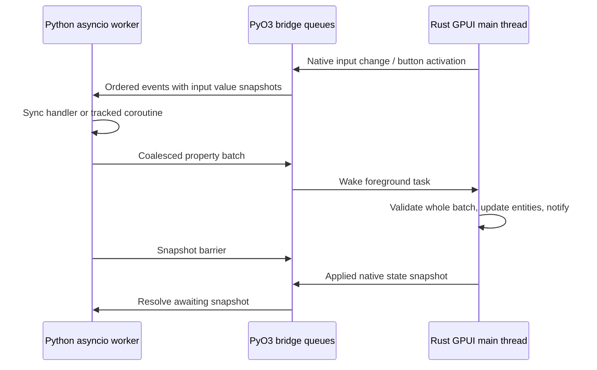

# gpyui architecture and first milestone

Status: source inspection completed before implementation, 2026-10-01.
`gpyui` replaces the working name Glint. Package-name availability has **not**
been checked. This is a desktop library, not a server, browser, or Flutter client.

## Product goal

gpyui exposes Longbridge's GPUI Kit components through a reusable Python API so
developers can write complete native desktop applications entirely in Python,
comparable in use to Tkinter and other Python UI toolkits. Rust is the internal
implementation of native rendering, component state, text editing and windows;
application authors compose controls and implement application behavior in Python.

The four-control milestone proves this bridge. It is the beginning of the
toolkit, not its intended final component set. Subsequent work should extend
actual GPUI Kit component coverage and make layout, styling, events, state and
application lifecycle accessible through Python. Document implemented capabilities
separately from planned coverage, and verify each wrapper against pinned sources.

## Native themes in 0.4.0

Python exposes immutable Theme descriptions with macOS, Windows/Fluent and shadcn
Zinc/Blue light/dark presets, custom colors, radii, typography and shadows. Rust
translates a validated description to Kit ThemeConfig and applies it through
Theme::update, synchronizing legacy component colors, background and Base tokens.
Queued runtime theme changes refresh rendering without remounting controls or
setting text values. Theme snapshots expose applied native state independently
of the requested Python description. See the [source-grounded plan](plans/native-themes.md)
and [theme guide](guide/themes.md) for verified APIs and limits.

Platform refinements after 0.4.0 add Rust-owned appearance hints alongside Kit's
ThemeConfig: editor surface and checked-switch color. The original Kit Input,
Textarea and Select entities render inside presentation-only frames, using their
original focus handles. Kit sizing/style hooks give macOS and Windows distinct
control geometry. Colors supported by Kit flow through ThemeConfig as before;
renderer-specific colors are validated before enqueue and installed before Kit
refreshes windows. Switching away resets every hint. Native snapshots report the
applied surface/switch/slider colors. Layout composition stays Python-owned.

## Commands and menus in 0.3.0

The implementation retains the pinned upstream baseline below. Before adding
menus we inspected [DropdownMenu](https://github.com/longbridge/gpui-kit/blob/3a142844d3661159964dce9e5512ca9a40286160/crates/component/src/menu/dropdown_menu.rs),
[ContextMenu](https://github.com/longbridge/gpui-kit/blob/3a142844d3661159964dce9e5512ca9a40286160/crates/component/src/menu/context_menu.rs),
[PopupMenu](https://github.com/longbridge/gpui-kit/blob/3a142844d3661159964dce9e5512ca9a40286160/crates/component/src/menu/popup_menu.rs),
[AppMenuBar](https://github.com/longbridge/gpui-kit/blob/3a142844d3661159964dce9e5512ca9a40286160/crates/component/src/menu/app_menu_bar.rs)
and [NativeMenu](https://github.com/longbridge/gpui-kit/blob/3a142844d3661159964dce9e5512ca9a40286160/crates/component/src/native_menu/mod.rs).
The actual NativeMenu conversion is `From<gpui::Menu>`; its doc comment's
`from_menu_items` method does not exist in the pinned implementation.

The implementation follows these verified steps:

1. Add Python Command/Menu models separate from controls, with stable IDs and
   window-lifetime ownership. Register references before validating/committing
   tree and menu configuration; reject duplicate shortcuts and cross-app reuse.
2. Represent native activation with a typed GPUI Action carrying the command ID.
   Bind keys in the window's root context. Kit buttons and popup items enqueue
   the same command event, including native editing snapshots; Python sync/async
   handlers continue on the existing asyncio worker.
3. Build actual Kit menus and retain weak popup entities so updates can rebuild
   open drawn menus without replacing editors or introducing ownership cycles.
   GPUI's menu action-context focus restoration remains native. Native menu
   overlays outside the view also need an application-level action fallback.
4. Use GPUI's system menus on macOS and Kit AppMenuBar on Windows/Linux. OS popup
   tracking remains in Kit NativeMenu, including the drawn Linux fallback.
   Capture assigned native context-menu presses before the input's built-in menu;
   for drawn menus suppress that input callback for the current right press.
   Kit restores the default editing-menu callback on the following render.
5. Test shared enabled/checked state, nested menu routing, dynamic registration,
   async snapshots and shutdown with actual native interactions and installed
   release wheels, then document the narrower platform guarantees.

Native command properties use explicit patches. Reconciliation never replays
old mutable command values. Button disablement combines local disabled state
with shared command enabled state. Source-bound drawn popup callbacks validate
that their host remains displayed and the command still belongs to its menu.
Commands themselves remain registered for the window lifetime. Menu and popup
refresh flags avoid reloading application menus on unrelated label/input edits.
OS-native open menus contain a snapshot, but the latest enabled gate is checked
again at activation. The public [commands guide](guide/commands.md) records
bounds, menu-update behavior and remaining command-palette/keymap gaps.

## Dynamic composition in 0.2.0

Python roots and container children now support runtime replacement, insertion,
removal, reordering and same-app moves. A structural update sends the owned
forest, active root IDs and explicit property patches in one queued command.
The bridge validates the entire command, including unique ownership, depth,
constructor identity and disposed IDs, before enqueueing and committing its
schema. Failed enqueue leaves the old native schema intact.

Rust reconciles by stable ID: existing native controls, entities and per-control
subscriptions are reused. Only children lists change; mutable tree-description
values are never replayed into existing editors. That distinction preserves
native edits that have not reached the Python mirror, caret, selection and undo
history. It follows Kit's retained `Entity<InputState>` contract and
[semantic undo transaction boundaries](https://github.com/longbridge/gpui-kit/blob/3a142844d3661159964dce9e5512ca9a40286160/crates/base/src/input/base/undo_manager.rs).

Visibility removes the control from layout without destroying its state. Removal
detaches but keeps ownership and bindings, allowing reattachment. Explicit
`dispose()` releases the subtree, native entities/subscriptions, Python bindings
and handlers; disposed IDs cannot be reused. Detached nodes count toward the
10,000-control bound. Native focus is blurred when an editing control becomes
hidden or detached; moving a displayed control retains its focus. Python ignores
disposed events and suppresses handlers for hidden or detached controls.

Open overlays read current children from the retained view, and carousel bounds
follow visible children. Property-only updates retain the existing compact
batch path. Structural commands serialize the retained forest; large-tree update
performance and a smaller structural diff protocol remain future measurement
work. There is still one window; themes can change at runtime.

The comparison and first-milestone plan below record the original investigation;
this section describes the current runtime contract.

## Reproducible upstream baseline

All four repositories were cloned into `/workspace/upstream`. Exact inspected
revisions are recorded in [upstream-lock.json](upstream-lock.json).

* GPUI Kit: `3a142844d3661159964dce9e5512ca9a40286160` (0.7.0).
* Zed/GPUI: `1a28cff4b409169bac058bca40dfbfeb7621d19b`.
* NiceGUI: `d0323a34fd87c51323e4fda60f6805d6fe8e329d`.
* Flet: `0ec63ca849386be77831241f21b82a0cc8c13942`.

Zed was initially cloned at `95cd535a5fad96d649513f96c5784ceefd379e47`.
GPUI Kit's workspace manifest pins the `gpui-pre-*` family to **exactly 0.3.7**.
The downloaded GPUI manifest's `[package.metadata.gpui-pre]` identifies the Zed
revision above. We fetched and checked out that revision to verify the actual
runtime being consumed. Do not add a second, git-head GPUI dependency: its types
would differ from Kit's. Depend on the pinned `gpui-kit` git revision and use its
facade. `Cargo.lock` pins registry versions, checksums, and git sources; the Rust
toolchain and PyO3 versions are explicit. No upstream repository is modified.

The Kit root AGENTS.md has a stale final bullet saying GPUI is a git dependency;
the manifest, facade implementation, and release pin checker are authoritative.

## Implementation evidence and adopted patterns

Links below identify actual implementations at the inspected revisions, rather
than tutorials. The local clones contain the same paths.

| Concern | NiceGUI implementation | Flet implementation | gpyui decision |
| --- | --- | --- | --- |
| Composition | [Element construction and context managers](https://github.com/zauberzeug/nicegui/blob/d0323a34fd87c51323e4fda60f6805d6fe8e329d/nicegui/element.py), [Slot task-specific stacks](https://github.com/zauberzeug/nicegui/blob/d0323a34fd87c51323e4fda60f6805d6fe8e329d/nicegui/slot.py) attach children to the current slot | [Column.controls](https://github.com/flet-dev/flet/blob/0ec63ca849386be77831241f21b82a0cc8c13942/sdk/python/packages/flet/src/flet/controls/core/column.py) stores an explicit ordered control list | Support both `Column([Label(...), ...])` and `with app: with Column(): ...`. A ContextVar stores immutable stack tuples, preventing shared mutable stacks across tasks. No implicit process-global application. |
| Control objects | Element owns ID, props, events, slots, parent/client references; client indexes elements | [BaseControl](https://github.com/flet-dev/flet/blob/0ec63ca849386be77831241f21b82a0cc8c13942/sdk/python/packages/flet/src/flet/controls/base_control.py) uses dataclass-based controls, stable identity, parent/page, mount/unmount hooks | Python controls are stable handles and property mirrors. A mounted tree has unique stable IDs and one owner per control. Rust owns the native representations and retained entities. Initial milestone freezes topology after mounting. |
| State binding | [binding.py](https://github.com/zauberzeug/nicegui/blob/d0323a34fd87c51323e4fda60f6805d6fe8e329d/nicegui/binding.py) uses BindableProperty setters, propagation graphs with visited nodes, and polling for active links to arbitrary attributes | [use_state](https://github.com/flet-dev/flet/blob/0ec63ca849386be77831241f21b82a0cc8c13942/sdk/python/packages/flet/src/flet/components/hooks/use_state.py) replaces state on inequality and schedules the owning component; observable state attaches lifecycle-owned subscriptions | An explicit `State` observable and `bind_text`/`bind_value`; changes propagate on setters/events, with equality guards. No arbitrary attribute polling or full React-style hook/reconciliation system in this milestone. Binding subscriptions can be disposed. |
| Updates | [Outbox](https://github.com/zauberzeug/nicegui/blob/d0323a34fd87c51323e4fda60f6805d6fe8e329d/nicegui/outbox.py) replaces pending updates by element ID and drains them asynchronously | [Session](https://github.com/flet-dev/flet/blob/0ec63ca849386be77831241f21b82a0cc8c13942/sdk/python/packages/flet/src/flet/messaging/session.py) computes ObjectPatch diffs and coalesces scheduled controls in a set; [ObjectPatch](https://github.com/flet-dev/flet/blob/0ec63ca849386be77831241f21b82a0cc8c13942/sdk/python/packages/flet/src/flet/controls/object_patch.py) tracks dataclass changes | Coalesce changes by `(control ID, property)` per asyncio turn, with explicit `app.update()` and `app.batch()` boundaries. One validated JSON batch crosses PyO3; Rust applies it in one foreground update and notifies the root once. Full tree diffing is unnecessary for a fixed tree. |
| Event handlers | [events.handle_event](https://github.com/zauberzeug/nicegui/blob/d0323a34fd87c51323e4fda60f6805d6fe8e329d/nicegui/events.py) supports zero/one argument, awaitable results, parent-slot context and centralized exceptions | BaseControl._trigger_event supports zero/one argument, sync/async and generator handlers; Session.after_event automatically updates unless disabled/explicitly updated | Resolve zero/one argument signatures once. Native callbacks only enqueue data. Python schedules tracked callback tasks on one owned asyncio loop, catches and reports failures, and flushes properties even while a coroutine awaits. Generator handlers are deferred. |
| asyncio and threads | [background_tasks](https://github.com/zauberzeug/nicegui/blob/d0323a34fd87c51323e4fda60f6805d6fe8e329d/nicegui/background_tasks.py) retains tasks, handles exceptions and tears them down | Current BaseControl calls synchronous handlers directly on its asyncio loop (do not assume the historical Flet thread-per-handler behavior). [app.py](https://github.com/flet-dev/flet/blob/0ec63ca849386be77831241f21b82a0cc8c13942/sdk/python/packages/flet/src/flet/app.py) owns asyncio/server lifecycle and connection executors | GPUI main thread and Python asyncio worker thread. Rust releases the GIL while running the platform loop. An async-channel wakes a GPUI foreground task; Python receives queued events via a blocking extension call in `asyncio.to_thread`, also without the GIL. Sync handlers must stay short; use `asyncio.to_thread` for blocking work. |
| Lifecycle | [nicegui.py](https://github.com/zauberzeug/nicegui/blob/d0323a34fd87c51323e4fda60f6805d6fe8e329d/nicegui/nicegui.py) uses ASGI lifespan; ui_run starts uvicorn; native mode uses a webview process | app.py creates socket/Dart/web connections, starts main per session, closes connections on shutdown | One native app run per process, main-thread entry, single window in milestone. Window close/`app.close()` ends native run, signals the event pump, cancels and gathers callback tasks, closes the asyncio loop, joins the worker, releases retained subscriptions. No web transport. |

## Verified native seam

* [Kit facade and open_window](https://github.com/longbridge/gpui-kit/blob/3a142844d3661159964dce9e5512ca9a40286160/crates/kit/src/lib.rs):
  `application`, `init`, `open_window` return the window and application entity;
  the helper installs Base Root. Component initialization registers window state.
* [hello_world](https://github.com/longbridge/gpui-kit/blob/3a142844d3661159964dce9e5512ca9a40286160/examples/hello_world/src/main.rs):
  Button is a lightweight builder, re-created during Rust render, with stable ID.
* [input example](https://github.com/longbridge/gpui-kit/blob/3a142844d3661159964dce9e5512ca9a40286160/examples/input/src/main.rs):
  retained `Entity<InputState>` and retained `Subscription` handles; rendering
  uses `Input::new(&state)` instead of creating an editor every frame.
* [editing state](https://github.com/longbridge/gpui-kit/blob/3a142844d3661159964dce9e5512ca9a40286160/crates/base/src/input/base/state.rs):
  InputEvent::Change, value(), default_value(), set_value(). Programmatic
  `set_value` emits **no** Change and clears undo history; gpyui documents this
  distinction and never re-sends native edits to Rust through the value setter.
* [GPUI Context](https://github.com/zed-industries/zed/blob/1a28cff4b409169bac058bca40dfbfeb7621d19b/crates/gpui/src/app/context.rs):
  `spawn_in` schedules a main-thread future with WeakEntity and
  AsyncWindowContext; `update_in` provides short-lived mutable contexts. Retain
  its Task on the root so close cancels it. Never move entities/windows across
  the Python boundary or call Python from `render`.
* [GPUI Application](https://github.com/zed-industries/zed/blob/1a28cff4b409169bac058bca40dfbfeb7621d19b/crates/gpui/src/app.rs):
  native platform.run owns the event loop; quit and window-close subscriptions
  belong to the application. Main-thread platform initialization is required.

## Implementation plan and acceptance gates

1. Reinitialize with the requested uv/maturin command (the earlier uv_build
   scaffold is preserved in `/tmp/glint-initial-uv-project`), then rename to gpyui.
2. Clone all four repositories, read applicable instructions, match Kit/GPUI
   snapshots and record immutable revisions. Complete this document before the
   bridge implementation; `cargo check --locked` validates actual compatibility.
3. Implement Column, Label, TextInput, Button, Application and explicit State;
   both context composition and explicit children use the same tree.
4. Implement Rust-owned tree/editor/window, validated property commands,
   channel-driven foreground updates, ordered native events, snapshot barriers,
   close and error signaling. Release the GIL around native run and waits.
5. Build the extension with maturin/uv; test composition ownership, state binding,
   invalid batches, callback failures, awaitable handlers and lifecycle.
6. Open a real native X11 window under Xvfb and Mesa software Vulkan. Type into
   the real Input, activate the Kit button using pointer and keyboard, and assert
   the Python-derived label through a native snapshot and rendered screenshot.
   Close normally and during an awaiting callback. Keep evidence and limitations
   in `validation.md`; never substitute mocked rendering for a native run.

## Original first-milestone scope

The original first milestone supported a static column tree with mutable labels, input
values/placeholders, button text/disabled state. It deferred dynamic topology, multiwindow,
arbitrary styling, timers API, async `run()` embedded in another main-thread loop,
Python render callbacks, or packaging claim. Python `.value` is the last received
native mirror; click events include current Rust input snapshots to make the
normal read-on-click workflow coherent. `await app.snapshot()` is a foreground
barrier, not a guarantee that a GPU frame has already been presented.

The channel protocol uses JSON for inspectability, not because IPC is necessary.
Batches and events stay in-process. Queues are bounded and reject overload
explicitly rather than blocking the UI or silently losing activations. Prototype
performance, high-rate input coalescing, topology reconciliation and finer entity
notification boundaries before expanding the API. GPU rendering releases the
GIL, but CPU-bound pure Python still competes for it with other Python tasks.

Linux/X11 has full native interaction tests. The [wheel workflow](releases.md)
also builds Linux ARM64, Windows x64/ARM64 and macOS Intel/Apple Silicon.
Windows and macOS use the pinned upstream platform backends and have native
window smoke tests, with OS mouse/keyboard interaction still to validate. Upstream
native libraries, GPU/display drivers, assets, and dependency licenses require
review before distributing wheels. Name availability remains unchecked.

## Expanded Kit catalog: verified implementation

The second pass expands the same bridge to 71 controls. It keeps the pinned Kit
and GPUI revisions; no alternate widget implementation or second GPUI version
was introduced. [Component coverage](component-coverage.md) is the complete
implemented inventory and remaining catalog work.

The following upstream contracts were inspected before writing their wrappers:

* [SliderState](https://github.com/longbridge/gpui-kit/blob/3a142844d3661159964dce9e5512ca9a40286160/crates/component/src/slider.rs),
  [SelectState](https://github.com/longbridge/gpui-kit/blob/3a142844d3661159964dce9e5512ca9a40286160/crates/component/src/select.rs)
  and [ComboboxState](https://github.com/longbridge/gpui-kit/blob/3a142844d3661159964dce9e5512ca9a40286160/crates/component/src/combobox.rs)
  are retained entities with native event subscriptions. The wrappers mount each
  entity once, read it for snapshots and render builders referencing it.
* [TableState and TableDelegate](https://github.com/longbridge/gpui-kit/blob/3a142844d3661159964dce9e5512ca9a40286160/crates/component/src/table/data_table.rs)
  retain native selection and scrolling. Python supplies string columns/rows;
  Rust owns the delegate. Assigning rows refreshes the native table.
* [TreeState](https://github.com/longbridge/gpui-kit/blob/3a142844d3661159964dce9e5512ca9a40286160/crates/component/src/tree.rs),
  [ResizableState](https://github.com/longbridge/gpui-kit/blob/3a142844d3661159964dce9e5512ca9a40286160/crates/component/src/resizable.rs)
  and native input/calendar/color entities follow that same ownership rule.
  Tree selection maps to stable Python item IDs; resize events carry native sizes.
* [WindowExt](https://github.com/longbridge/gpui-kit/blob/3a142844d3661159964dce9e5512ca9a40286160/crates/component/src/window_ext.rs)
  provides dialog, sheet and notification operations through the installed Root.
  Python open/close commands execute on the foreground task; native dismissal
  emits a change event back to Python. Overlay content is the existing Python
  control tree rendered in Rust, with one dialog and one sheet per window.
* [TextView](https://github.com/longbridge/gpui-kit/blob/3a142844d3661159964dce9e5512ca9a40286160/crates/component/src/text/compat.rs)
  renders Markdown/HTML natively. Editor keeps an InputState editing buffer.
  Python never supplies a per-frame render callback.
* [Chart builders](https://github.com/longbridge/gpui-kit/blob/3a142844d3661159964dce9e5512ca9a40286160/crates/component/src/chart/mod.rs)
  consume Rust-owned point data. Python can replace datasets through the same
  coalesced property queue. Plot rendering and hover behavior stay native.

A Kit node extends the original typed tree with a whitelisted component kind,
validated property map, children and style. Both Python and Rust check contracts;
Rust validates an entire update batch before enqueuing it. Component parameters
that define native construction (for example slider range, select items and OTP
length) are immutable after construction. Collection properties are copied on
assignment/read to avoid mutations that bypass the queue.

Lightweight controlled builders immediately update Rust state on interaction and
notify the view, then queue their Python event. Stateful builders update their
retained native entities. Event snapshots now include all value-bearing controls,
so the existing activation-order guarantee also applies to the broader catalog.
Python updates mirrors/bindings before starting a callback, yields to start it,
and only then processes subsequent queued events. Async callbacks remain tracked
by the original owned worker loop and cancellation lifecycle.

Layout styles use pixel dimensions and Kit semantic theme colors. Layout styles
are applied to the layout node itself, so gaps/alignment affect its children.
Leaf styles wrap the actual Kit component. Explicit sizes do not shrink, while
flexible panes can shrink within the window. Themes can be chosen at startup or switched on the callback loop.

The [workspace](https://github.com/gtrefalt/gpyui/blob/main/examples/workspace.py) and [gallery](https://github.com/gtrefalt/gpyui/blob/main/examples/gallery.py)
are public Python API examples, not Rust-specific demos. The workspace simplifies
the reference trading terminal to a watchlist, one chart, a market tape, an order
form and a paper-order table. A seeded asyncio stream batches simulated quotes
and trades every 650 ms; its callback is cancelled on native close. A native button invokes an async Python handler that appends
an order, updates status and shows a Kit notification. It makes no network trades.

Current limits: single window and basic builder options. Virtualized list delegates, typed forms,
docking, multiwindow and additional plot families remain explicit implementation
work. Acceptance gates for these next steps are recorded in the coverage guide.
