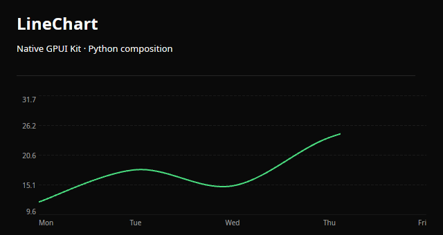
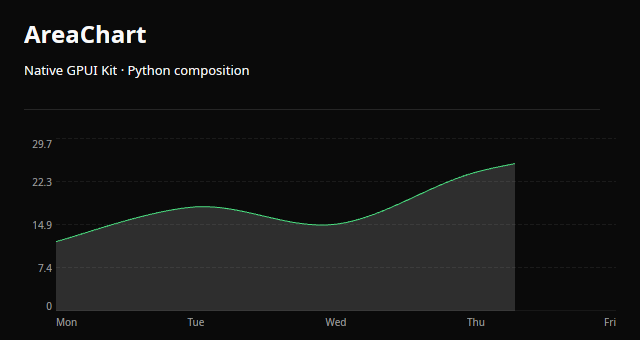
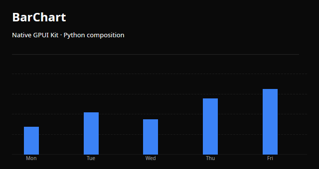
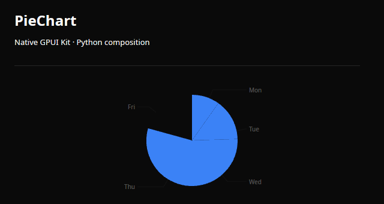
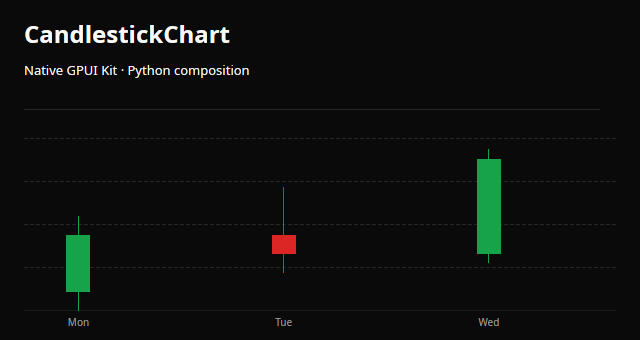

# Charts

Native charts controls composed in Python.

<a class="component-card" href="../line-chart/">

<strong>LineChart</strong>Native line plot with data-following domain.
</a>
<a class="component-card" href="../area-chart/">

<strong>AreaChart</strong>A native filled area plot.
</a>
<a class="component-card" href="../bar-chart/">

<strong>BarChart</strong>A native bar plot.
</a>
<a class="component-card" href="../pie-chart/">

<strong>PieChart</strong>A native pie plot with nonnegative values.
</a>
<a class="component-card" href="../candlestick-chart/">

<strong>CandlestickChart</strong>Native OHLC candles.
</a>

