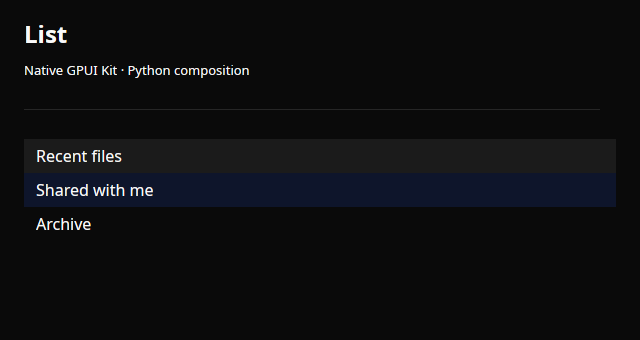
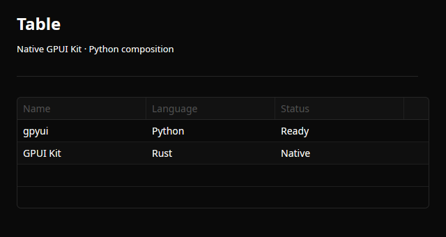
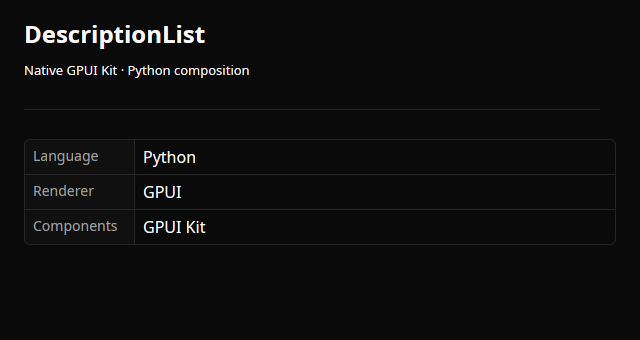

# Data

Native data controls composed in Python.

**[List](../list.md)**

Compose selectable native ListItems.

**[Table](../table.md)**

Native retained table state with string rows.

**[Tree](../tree.md)**

Native tree selection with stable item IDs.

**[DescriptionList](../description-list.md)**

Native label/value presentation.

