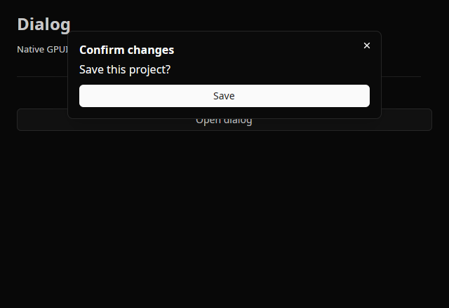

# Dialog

A native dialog containing Python controls.



A real Linux/X11 native capture. The preview uses dark appearance; the same control supports the initial light theme.

## Runnable example

```python
import gpyui as ui

control = ui.Dialog(
    "Confirm changes", children=[ui.Label("Save this project?"), ui.Button("Save", variant="primary")]
)
open_button = ui.Button("Open dialog", on_click=control.open)

app = ui.Application(ui.Column([control, open_button]), title="Dialog", width=640, height=440)
app.run()
```

Run this in a fresh Python process on a desktop with the native build installed.

## Properties

| Property | Default | Type / accepted values | Update |
| --- | --- | --- | --- |
| `title` | `""` | str | Constructor only |
| `value` | `false` | bool | Assignment |

Accepts `children=[...]`, a `with` block, and `add(...)` before mounting. Each child has one parent. The mounted topology is fixed.

Construct explicit child lists outside a composition context, as in the example. Inside a `with` block, construct the parent first and then its children.

## Events and state

- `on_change(event)`: Runs after native value and Python mirror/bound State change.

Handlers can take zero arguments or one `Event`, and can be synchronous or async. They run on the owned Python asyncio loop. See [events and asyncio](../guide/events.md).

`bind_value(State(...))` binds both ways without echoing native edits back through setters. `unbind()` disposes the subscription. See [state binding](../guide/state.md).

## Contract and limits

Use open()/close(), or assign value. One dialog per window; title is fixed.

All controls accept [pixel layout and semantic theme styling](../guide/styling.md) through `.style(...)`. Collections are copied on assignment/read: reassign them to submit updates.

[Python implementation](https://github.com/gtrefalt/gpyui/blob/main/src/gpyui/widgets.py#L651) · [Native builders](https://github.com/gtrefalt/gpyui/blob/main/src/kit.rs) · [Full coverage and remaining Kit APIs](../component-coverage.md)
