# Components

Browse all **71 Python controls**. Each page includes a native preview, an executable Python example, accepted properties and events. These are real GPUI/Kit controls, not browser replicas.

Use the site search to find a control by name. [Coverage and remaining APIs](../component-coverage.md) distinguishes the initial wrappers from full Kit parity.

## Layout

[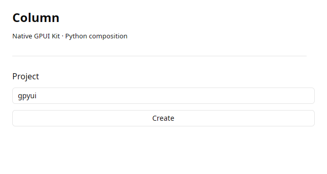](column.md)

**[Column](column.md)**

Stack controls vertically.

[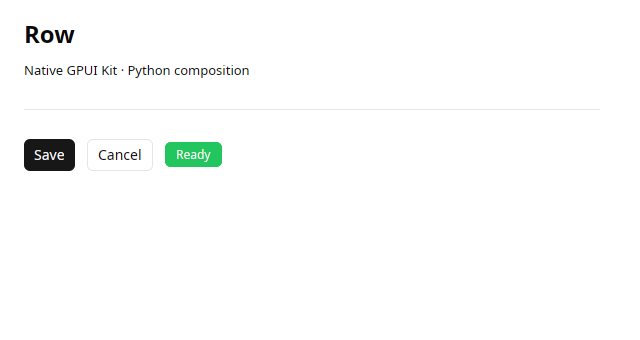](row.md)

**[Row](row.md)**

Arrange controls horizontally.

[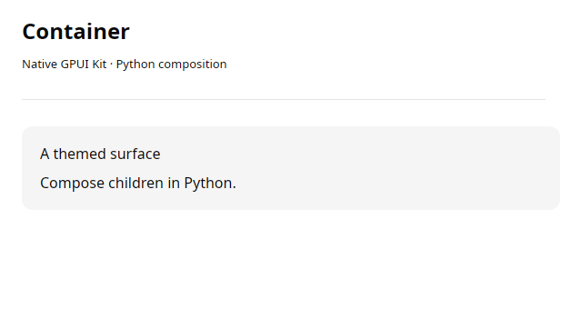](container.md)

**[Container](container.md)**

A composable GPUI layout surface.

**[Scroll](scroll.md)**

Native vertical scrolling for composed children.

[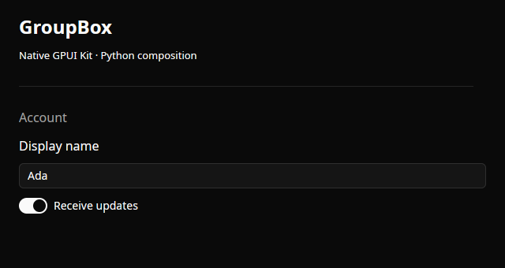](group-box.md)

**[GroupBox](group-box.md)**

Group related controls with a native title.

[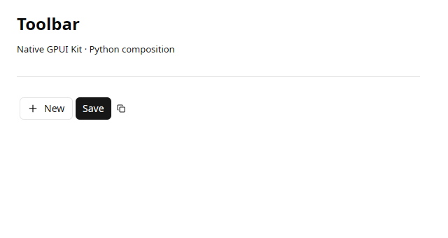](toolbar.md)

**[Toolbar](toolbar.md)**

Compose a native toolbar.

[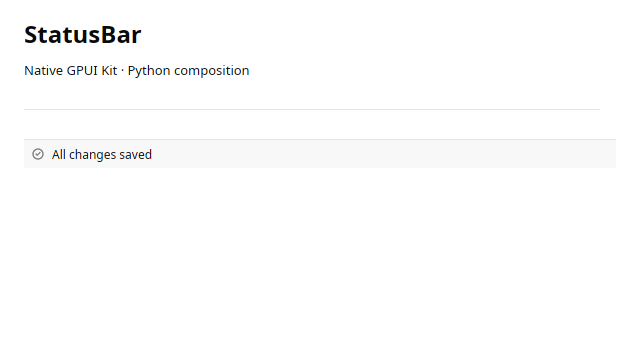](status-bar.md)

**[StatusBar](status-bar.md)**

Native status content composed in Python.

[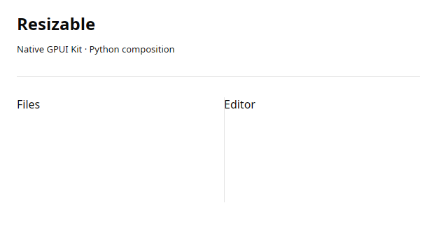](resizable.md)

**[Resizable](resizable.md)**

Native draggable boundaries between panes.

## Text and buttons

[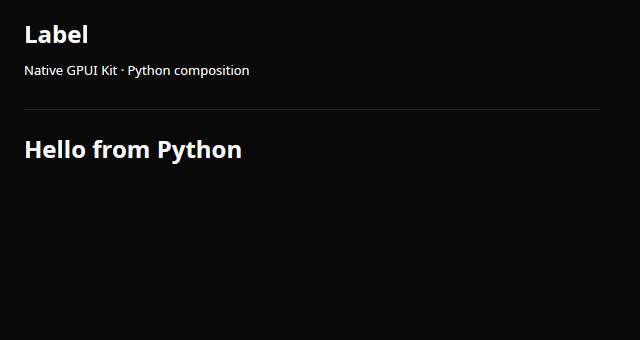](label.md)

**[Label](label.md)**

A native text label.

[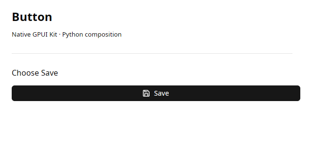](button.md)

**[Button](button.md)**

Native activation invokes Python callbacks.

[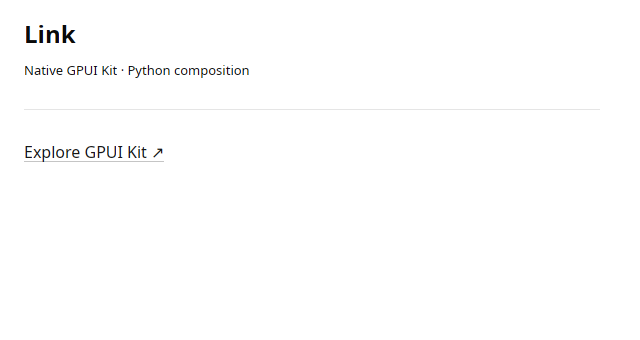](link.md)

**[Link](link.md)**

A native link with optional Python activation.

[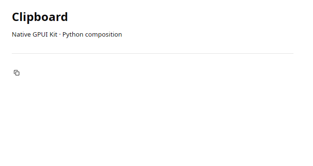](clipboard.md)

**[Clipboard](clipboard.md)**

Copy a string using the native clipboard.

[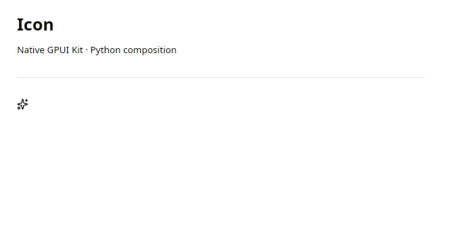](icon.md)

**[Icon](icon.md)**

Bundled Lucide icons rendered natively.

[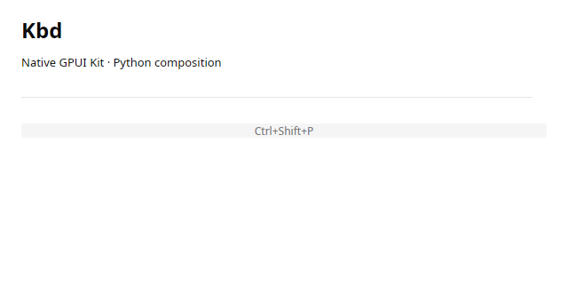](kbd.md)

**[Kbd](kbd.md)**

Display a parsed native keyboard shortcut.

[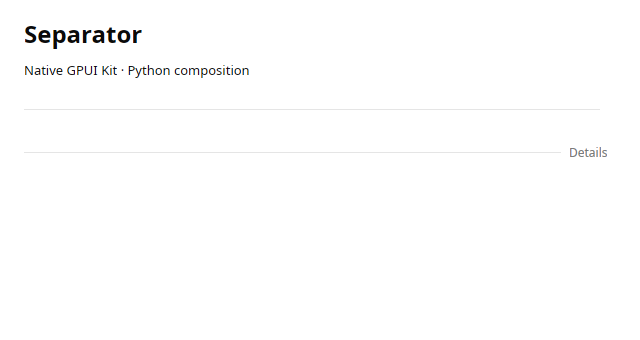](separator.md)

**[Separator](separator.md)**

A native divider, optionally with a label.

## Inputs

[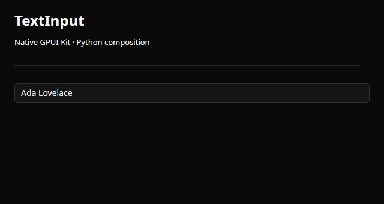](text-input.md)

**[TextInput](text-input.md)**

Native single-line text editing.

[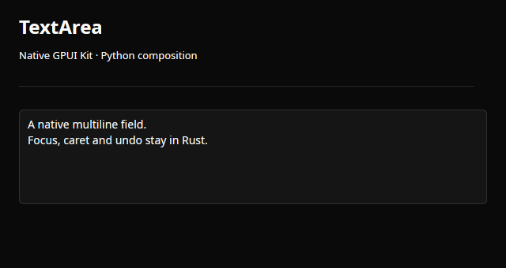](text-area.md)

**[TextArea](text-area.md)**

Native multiline editing.

[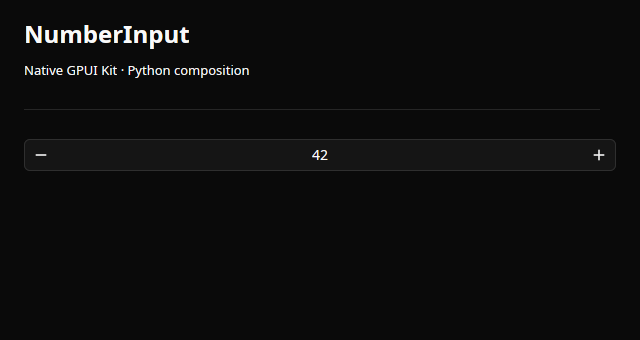](number-input.md)

**[NumberInput](number-input.md)**

A native numeric editing buffer with step buttons.

[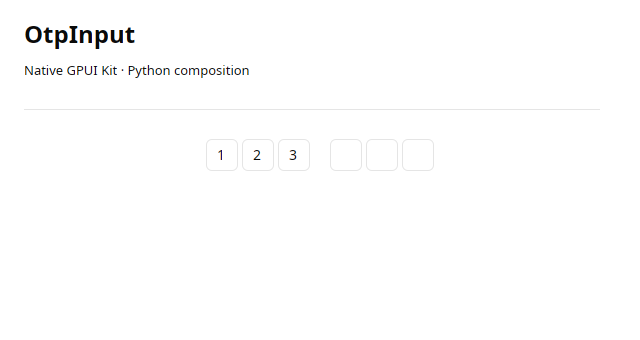](otp-input.md)

**[OtpInput](otp-input.md)**

Native one-time-code editing.

[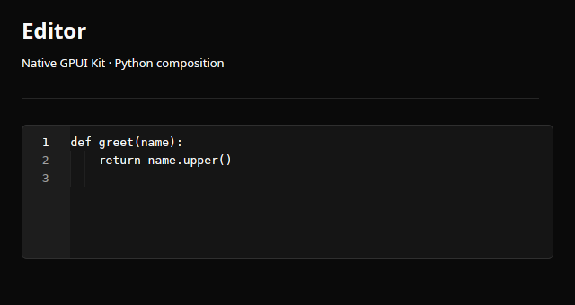](editor.md)

**[Editor](editor.md)**

A retained native editor buffer.

## Selection

[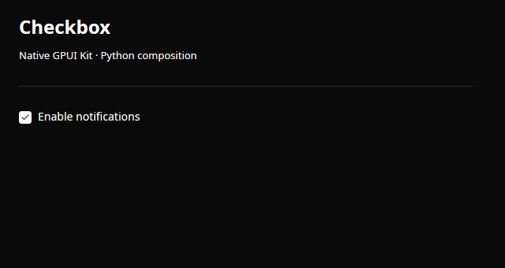](checkbox.md)

**[Checkbox](checkbox.md)**

An independent boolean choice.

[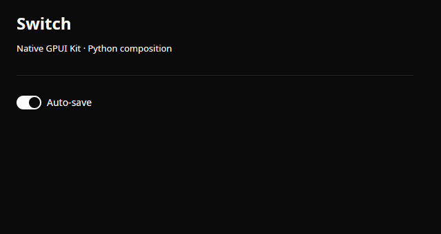](switch.md)

**[Switch](switch.md)**

A native boolean switch.

[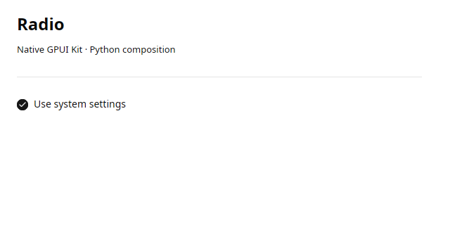](radio.md)

**[Radio](radio.md)**

A standalone native radio control.

[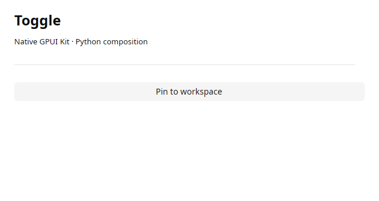](toggle.md)

**[Toggle](toggle.md)**

A boolean button-like toggle.

[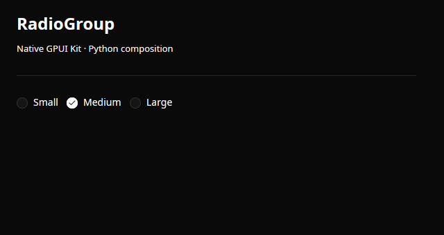](radio-group.md)

**[RadioGroup](radio-group.md)**

An exclusive indexed native choice.

[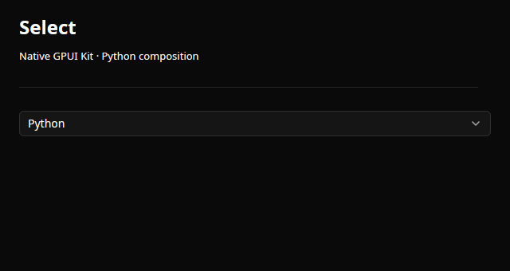](select.md)

**[Select](select.md)**

A retained native single-selection dropdown.

[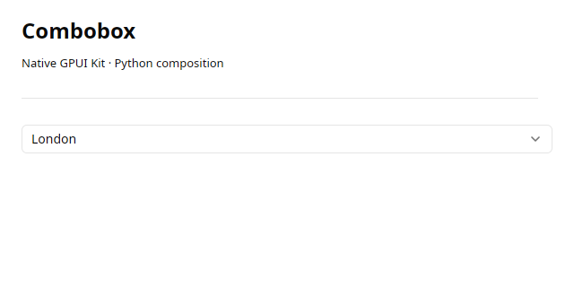](combobox.md)

**[Combobox](combobox.md)**

Search within native string choices.

[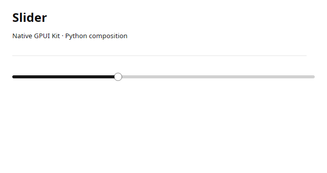](slider.md)

**[Slider](slider.md)**

A retained native scalar slider.

[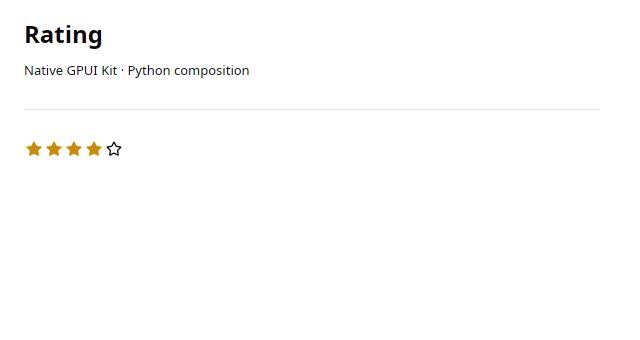](rating.md)

**[Rating](rating.md)**

Native zero-to-five rating.

## Navigation

[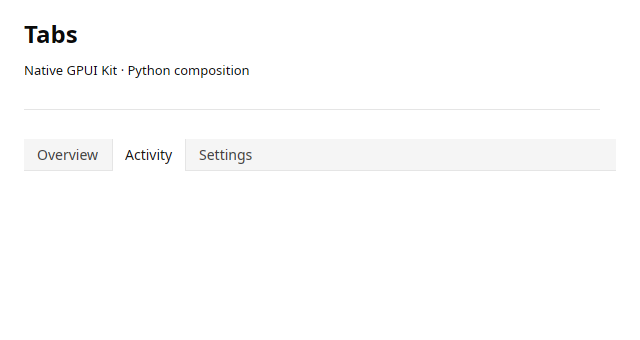](tabs.md)

**[Tabs](tabs.md)**

Native selection among labeled tabs.

[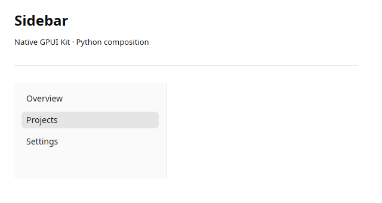](sidebar.md)

**[Sidebar](sidebar.md)**

Native sidebar navigation.

[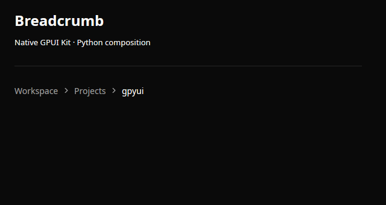](breadcrumb.md)

**[Breadcrumb](breadcrumb.md)**

Native breadcrumb selection.

[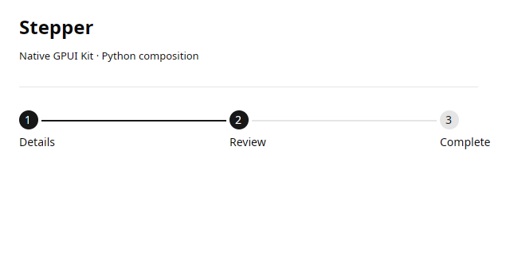](stepper.md)

**[Stepper](stepper.md)**

Native steps with indexed selection.

[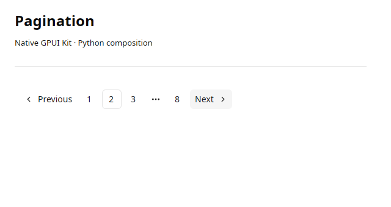](pagination.md)

**[Pagination](pagination.md)**

A native pagination control.

## Data

**[List](list.md)**

Compose selectable native ListItems.

**[Table](table.md)**

Native retained table state with string rows.

**[Tree](tree.md)**

Native tree selection with stable item IDs.

**[DescriptionList](description-list.md)**

Native label/value presentation.

## Charts

**[LineChart](line-chart.md)**

Native line plot with data-following domain.

**[AreaChart](area-chart.md)**

A native filled area plot.

**[BarChart](bar-chart.md)**

A native bar plot.

**[PieChart](pie-chart.md)**

A native pie plot with nonnegative values.

**[CandlestickChart](candlestick-chart.md)**

Native OHLC candles.

## Date, time and color

[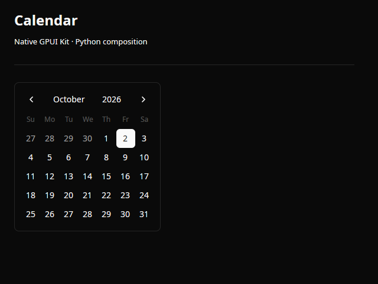](calendar.md)

**[Calendar](calendar.md)**

Retained native calendar selection.

[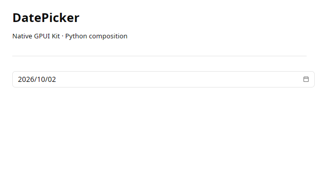](date-picker.md)

**[DatePicker](date-picker.md)**

Native single-date picker.

[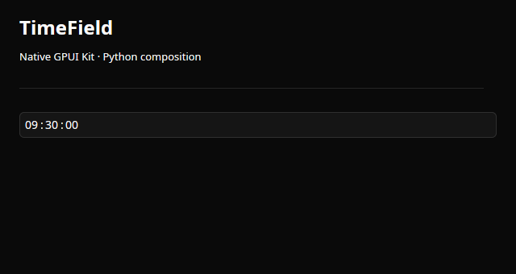](time-field.md)

**[TimeField](time-field.md)**

Native local time editing.

[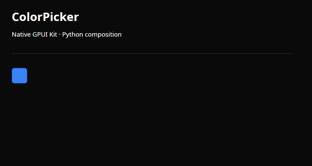](color-picker.md)

**[ColorPicker](color-picker.md)**

Native RGB/RGBA color selection.

## Feedback

**[Progress](progress.md)**

Native percentage progress.

[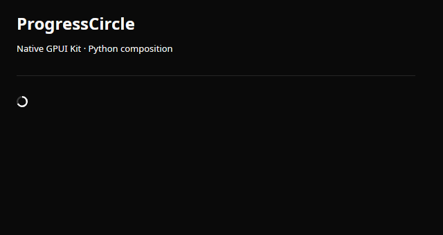](progress-circle.md)

**[ProgressCircle](progress-circle.md)**

Native circular percentage progress.

[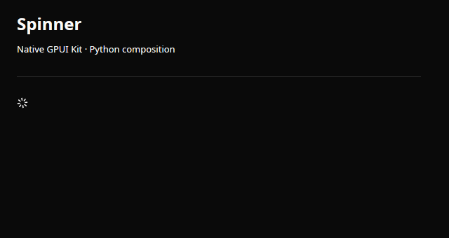](spinner.md)

**[Spinner](spinner.md)**

Native animated busy feedback.

[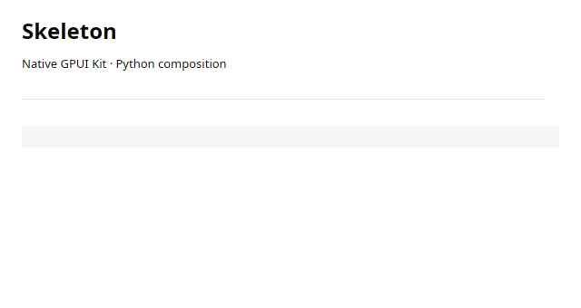](skeleton.md)

**[Skeleton](skeleton.md)**

Native placeholder feedback.

[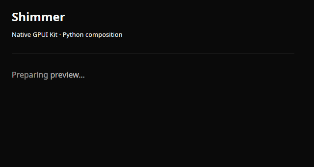](shimmer.md)

**[Shimmer](shimmer.md)**

Native animated loading text.

[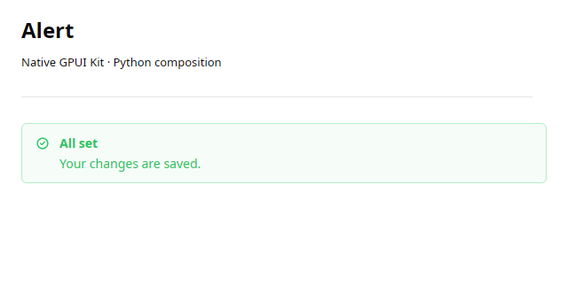](alert.md)

**[Alert](alert.md)**

Native semantic status messages.

[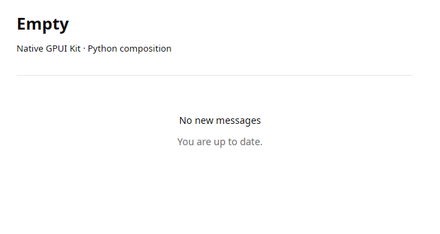](empty.md)

**[Empty](empty.md)**

Native empty-state presentation.

## Content

[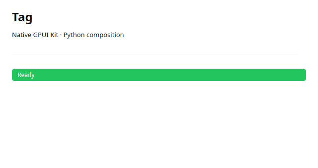](tag.md)

**[Tag](tag.md)**

Native text tags with semantic variants.

[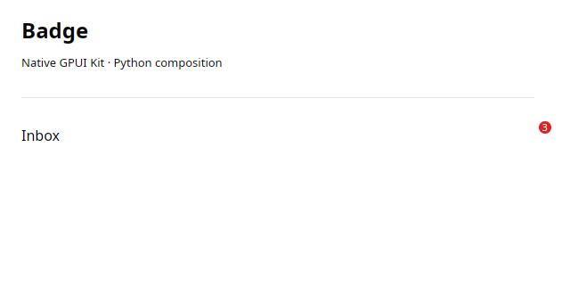](badge.md)

**[Badge](badge.md)**

Native count badges.

[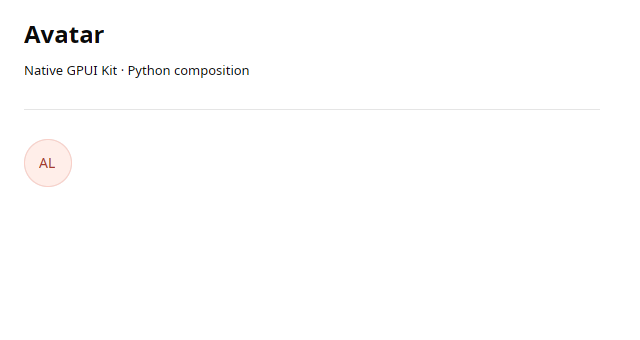](avatar.md)

**[Avatar](avatar.md)**

Native initials generated from a name.

[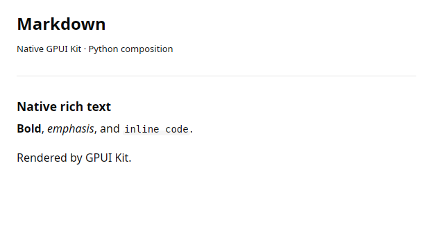](markdown.md)

**[Markdown](markdown.md)**

Native rich text from Markdown.

[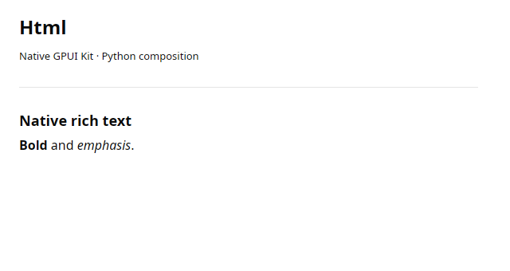](html.md)

**[Html](html.md)**

Native rich text from supported HTML.

[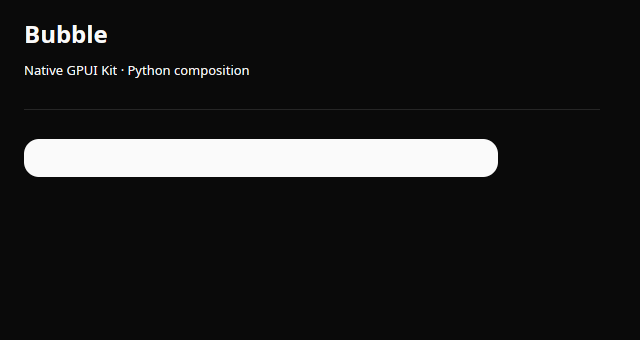](bubble.md)

**[Bubble](bubble.md)**

Native bubble content composed in Python.

**[Message](message.md)**

Native authored message presentation.

[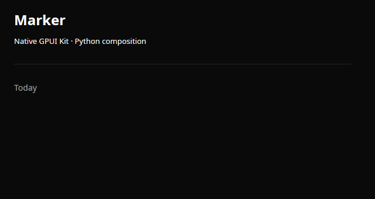](marker.md)

**[Marker](marker.md)**

Native message/date marker.

[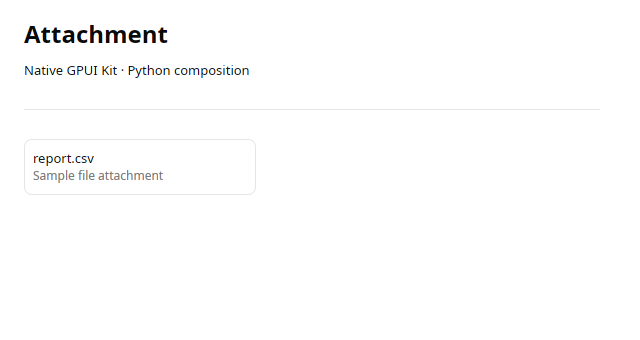](attachment.md)

**[Attachment](attachment.md)**

Native attachment presentation.

## Disclosure

[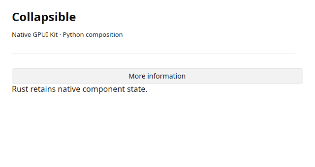](collapsible.md)

**[Collapsible](collapsible.md)**

Native disclosure for Python-composed content.

[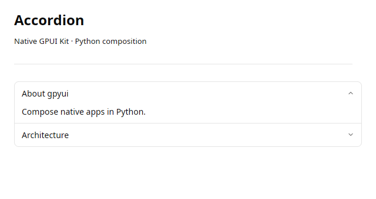](accordion.md)

**[Accordion](accordion.md)**

Native disclosure among labeled items.

[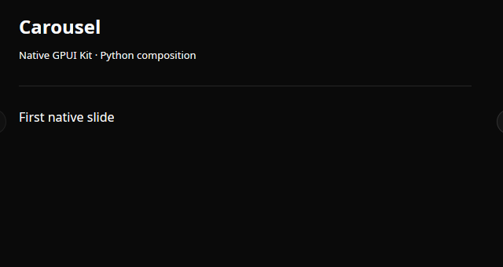](carousel.md)

**[Carousel](carousel.md)**

Native slide selection.

## Overlays

**[Tooltip](tooltip.md)**

Native tooltip attached to composed content.

**[Popover](popover.md)**

Native popup with Python-composed contents.

**[HoverCard](hover-card.md)**

Native hover preview content.

**[Dialog](dialog.md)**

A native dialog containing Python controls.

**[Sheet](sheet.md)**

A native side panel containing Python controls.

