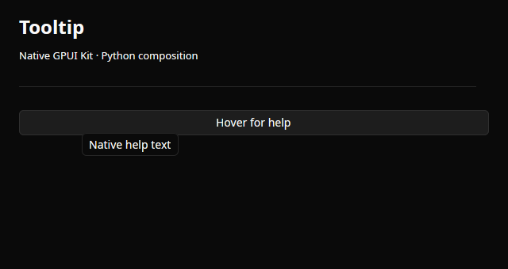
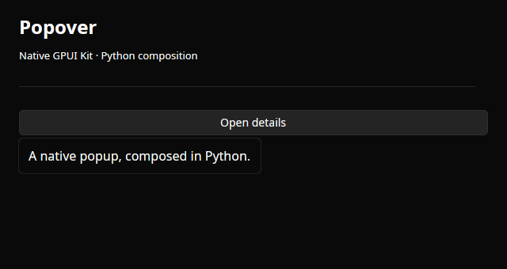
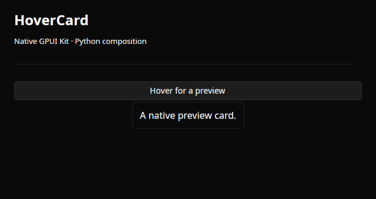
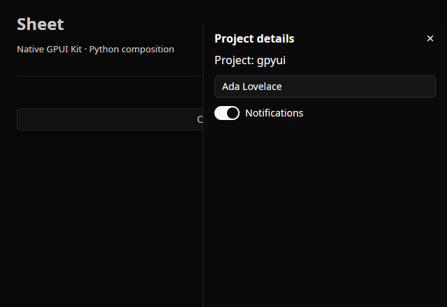

# Overlays

Native overlays controls composed in Python.

<a class="component-card" href="../tooltip/">

<strong>Tooltip</strong>Native tooltip attached to composed content.
</a>
<a class="component-card" href="../popover/">

<strong>Popover</strong>Native popup with Python-composed contents.
</a>
<a class="component-card" href="../hover-card/">

<strong>HoverCard</strong>Native hover preview content.
</a>
<a class="component-card" href="../dialog/">

<strong>Dialog</strong>A native dialog containing Python controls.
</a>
<a class="component-card" href="../sheet/">

<strong>Sheet</strong>A native side panel containing Python controls.
</a>

