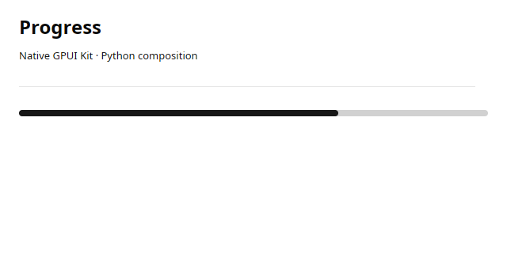

# Progress

Native percentage progress.



A real Linux/X11 native capture in light appearance. The same control also supports the initial dark theme.

## Runnable example

```python
import gpyui as ui

control = ui.Progress(68).style(full_width=True)

app = ui.Application(ui.Column([control]), title="Progress", width=640, height=340)
app.run()
```

Run this in a fresh Python process on a desktop with the native build installed.

## Properties

| Property | Default | Type / accepted values | Update |
| --- | --- | --- | --- |
| `value` | `0` | percentage (0–100) | Assignment |
| `loading` | `false` | bool | Assignment |

## Events and state

This wrapper exposes no Python activation/change handler. Update its mutable properties by assignment from a running callback. Native behavior remains in Rust.

## Contract and limits

value is a percentage from 0 through 100. loading enables indeterminate feedback.

All controls accept [pixel layout and semantic theme styling](../guide/styling.md) through `.style(...)`. Collections are copied on assignment/read: reassign them to submit updates.

[Python implementation](https://github.com/gtrefalt/gpyui/blob/main/src/gpyui/widgets.py#L363) · [Native builders](https://github.com/gtrefalt/gpyui/blob/main/src/kit.rs) · [Full coverage and remaining Kit APIs](../component-coverage.md)
