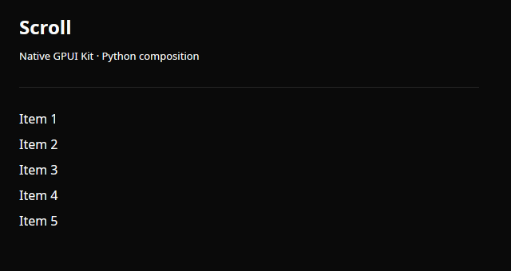

# Scroll

Native vertical scrolling for composed children.



A real Linux/X11 native capture. The preview uses dark appearance; the same control supports the initial light theme.

## Runnable example

```python
import gpyui as ui

control = ui.Scroll([ui.Label(f"Item {i}") for i in range(1, 13)]).style(height=160, full_width=True)

app = ui.Application(ui.Column([control]), title="Scroll", width=640, height=340)
app.run()
```

Run this in a fresh Python process on a desktop with the native build installed.

## Properties

This control has no component-specific constructor properties.

Accepts `children=[...]`, a `with` block, and `add(...)` before mounting. Each child has one parent. The mounted topology is fixed.

Construct explicit child lists outside a composition context, as in the example. Inside a `with` block, construct the parent first and then its children.

## Events and state

This wrapper exposes no Python activation/change handler. Update its mutable properties by assignment from a running callback. Native behavior remains in Rust.

## Contract and limits

Use a bounded height or flexible parent so content has a viewport.

All controls accept [pixel layout and semantic theme styling](../guide/styling.md) through `.style(...)`. Collections are copied on assignment/read: reassign them to submit updates.

[Python implementation](https://github.com/gtrefalt/gpyui/blob/main/src/gpyui/widgets.py#L262) · [Native builders](https://github.com/gtrefalt/gpyui/blob/main/src/kit.rs) · [Full coverage and remaining Kit APIs](../component-coverage.md)
