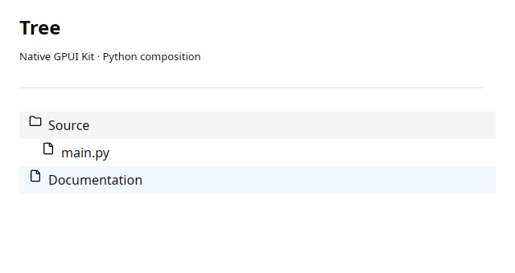

# Tree

Native tree selection with stable item IDs.



A real Linux/X11 native capture in light appearance. The same control also supports the initial dark theme.

## Runnable example

```python
import gpyui as ui

control = ui.Tree(
    [
        {"id": "src", "text": "Source", "children": [{"id": "src/main.py", "text": "main.py"}]},
        {"id": "docs", "text": "Documentation"},
    ],
    value="docs",
).style(height=160)

app = ui.Application(ui.Column([control]), title="Tree", width=640, height=340)
app.run()
```

Run this in a fresh Python process on a desktop with the native build installed.

## Properties

| Property | Default | Type / accepted values | Update |
| --- | --- | --- | --- |
| `items` | `[]` | list[tree item] | Constructor only |
| `value` | `""` | str | Assignment |

## Events and state

- `on_change(event)`: Runs after native value and Python mirror/bound State change.

Handlers can take zero arguments or one `Event`, and can be synchronous or async. They run on the owned Python asyncio loop. See [events and asyncio](../guide/events.md).

`bind_value(State(...))` binds both ways without echoing native edits back through setters. `unbind()` disposes the subscription. See [state binding](../guide/state.md).

## Contract and limits

Item IDs must be unique. value is an item ID or an empty string. Items are fixed; at most 10,000 items and 32 levels.

All controls accept [pixel layout and semantic theme styling](../guide/styling.md) through `.style(...)`. Collections are copied on assignment/read: reassign them to submit updates.

[Python implementation](https://github.com/gtrefalt/gpyui/blob/main/src/gpyui/widgets.py#L716) · [Native builders](https://github.com/gtrefalt/gpyui/blob/main/src/kit.rs) · [Full coverage and remaining Kit APIs](../component-coverage.md)
