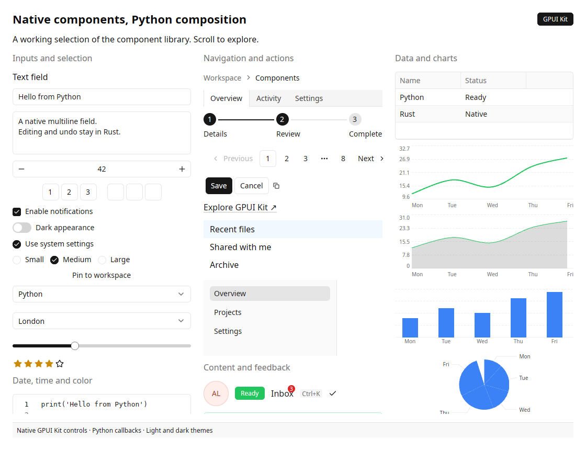

# Component gallery



The scrollable gallery composes Kit inputs, navigation, feedback, data and charts
in a native three-column window. Run it locally to interact with the controls:

```bash
uv run python examples/gallery.py
uv run python examples/gallery.py --theme dark
```

For focused examples, open one [catalog specimen](../components/index.md):

```bash
uv run python examples/component_preview.py Slider
uv run python examples/component_preview.py Dialog --theme light
uv run python examples/component_preview.py Tree
```

These commands open real GPUI windows. The documentation previews are captures
of those native specimens, not interactive browser implementations.

The [catalog](../components/index.md) provides all 71 controls, individual images,
property tables and complete runnable examples. Animated controls' screenshots
capture one frame. Popup previews open the actual native overlay before capture.

[Gallery source](https://github.com/gtrefalt/gpyui/blob/main/examples/gallery.py) ·
[Shared specimen source](https://github.com/gtrefalt/gpyui/blob/main/examples/component_catalog.py)
