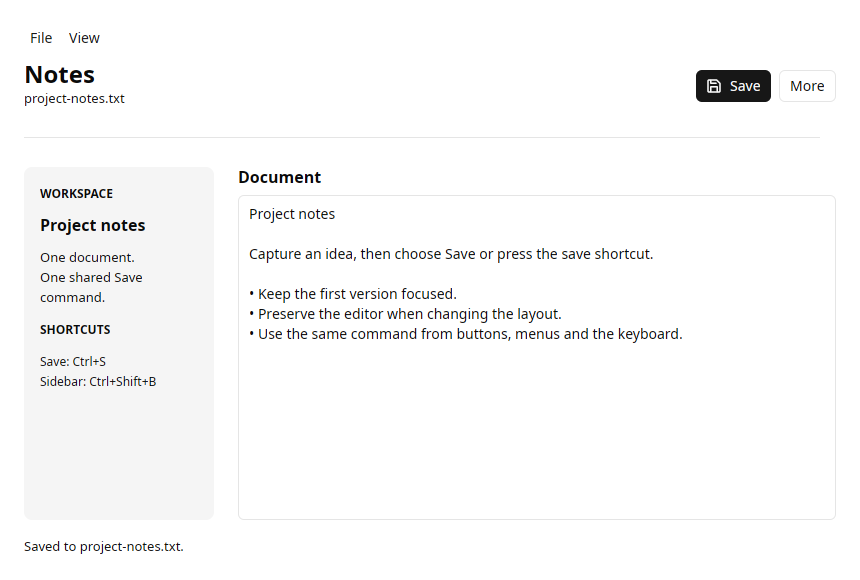

# Notes editor



A real native application built with Python and GPUI Kit. The Save button,
File menu, dropdown and editor context menu share a `Command`. Press Ctrl+S
(Command+S on macOS) to run the same asynchronous save callback.

```bash
uv run python examples/notes.py --file notes.txt
```

Run from a source checkout after installing native prerequisites, or copy
[notes.py](https://github.com/gtrefalt/gpyui/blob/main/examples/notes.py) into an app
with `uv add gpyui` and use `uv run python notes.py --file notes.txt`.

The example loads an existing UTF-8 file or starts with sample text. It writes
only when Save is activated. All Save entry points disable during disk I/O;
a persistent status message reports success or an actionable failure.

The checked View → Show sidebar command also works through Ctrl/Command+Shift+B.
It hides the sidebar while preserving the editor's identity, caret and undo
history. Right-click the document to access its application commands.

See [commands and menus](../guide/commands.md) for API and platform details.
The screenshot is an actual Linux/X11 native capture in light appearance.
