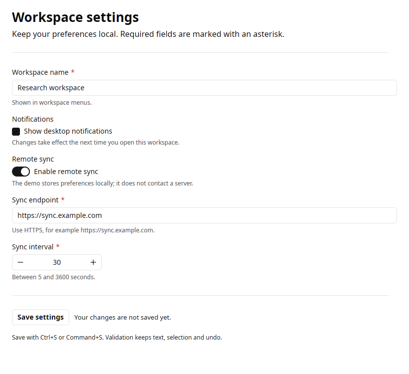
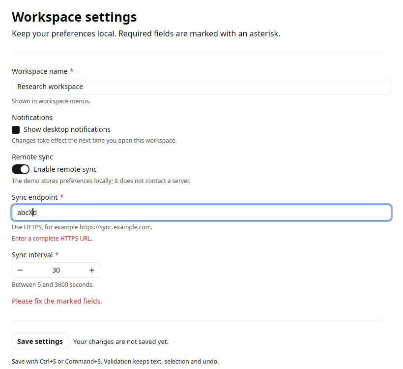
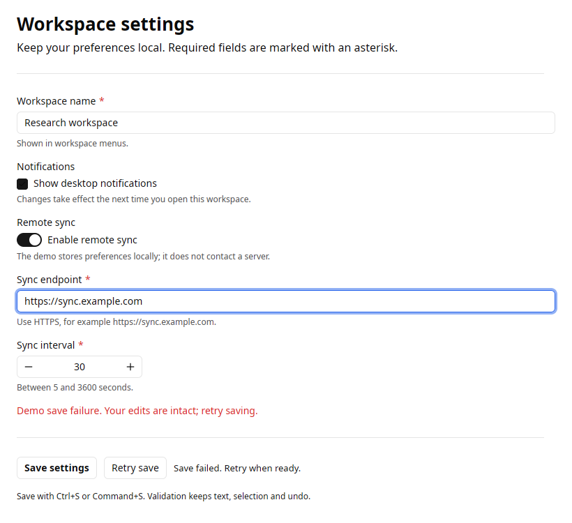
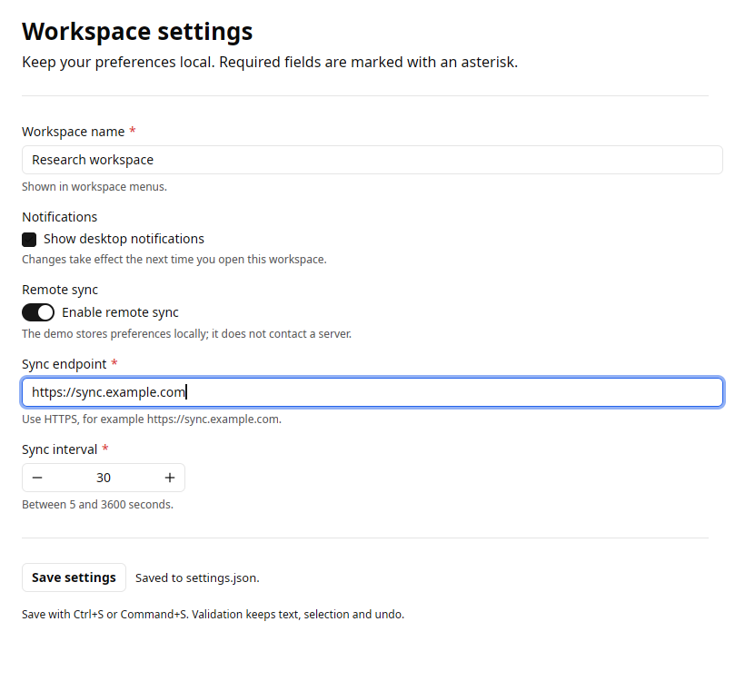

# Settings editor

The light-theme settings editor uses native Kit Form and Field, conditional
fields, Python validation, async file saving and a retry action. It is included
in gpyui 0.5.0.



From the repository, after [source setup](../guide/install.md):

```bash
uv run python examples/settings.py --file settings.json --fail-first-save
```

The first valid save deliberately fails, without writing a file. Retry saves a
local JSON file atomically through a temporary file and rename. The demo never
contacts the configured endpoint. Omit `--fail-first-save` for normal saving.

- Workspace name requires at least three characters.
- Turning Remote sync off hides endpoint and interval. They retain their values
  and are omitted from validation and the saved dict until shown again.
- Endpoint requires an HTTPS URL; interval accepts 5–3600 whole seconds. Its
  native editing value stays a string, with domain conversion in the save callback.
- Save settings, Retry save and Ctrl+S/Command+S share one submission command.
  Both buttons are disabled while validation/saving runs; a spinner and text
  identify pending work. Failure restores the action without rebuilding editors.

## Validation and retry







Native Linux/X11 tests type text, submit with a caret and selection active, then
exercise insertion, undo, redo, conditional visibility, duplicate prevention,
the real Retry button and shutdown during an awaited save. These PNGs come from
that native acceptance run. Platform-independent tests separately validate the
JSON payload and failure behavior.

[Example source](https://github.com/gtrefalt/gpyui/blob/main/examples/settings.py) ·
[Forms guide](../guide/forms.md) · [Commands guide](../guide/commands.md)
