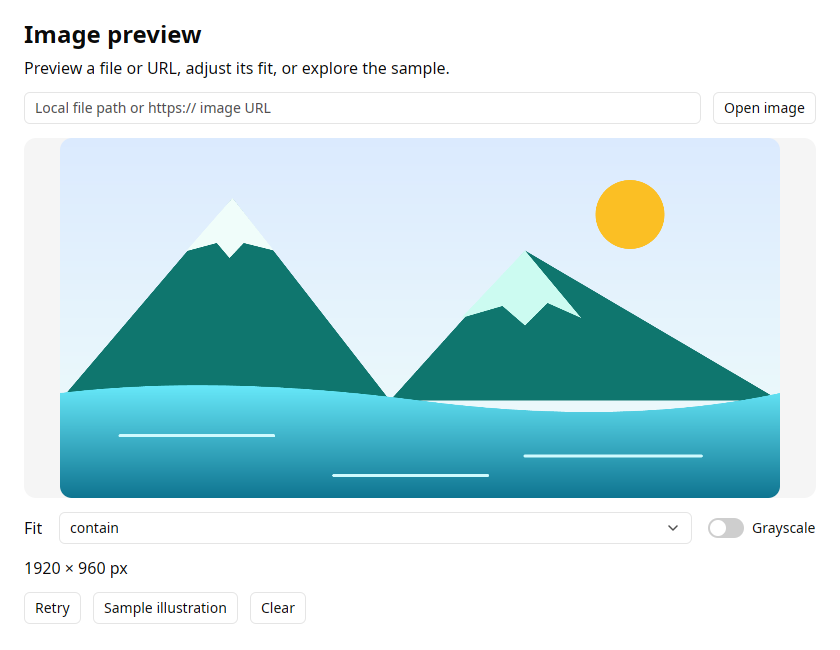

# Images

`Image` displays full-color raster images and SVG, with native asynchronous
loading and decoding. Animated GIF/WebP also play in an active window.
This binding is available from gpyui 0.6.1.



```python
import gpyui as ui

status = ui.Label("Loading…")
image = ui.Image(
    "photos/landscape.png",
    fit="contain",
    on_load=lambda event: setattr(status, "text", f"Loaded {event.value['width']} px wide"),
    on_error=lambda event: setattr(status, "text", "Check the image location and retry."),
).style(width=480, height=270, radius=12, background="muted")

app = ui.Application(
    ui.Column([image, status, ui.Button("Retry", on_click=image.reload)]),
    title="Image preview",
    width=540,
    height=400,
    theme="light",
)
app.run()
```

## Sources

| Python value | Native source |
| --- | --- |
| `"photos/a.png"` or `Path("photos/a.png")` | Filesystem path, made absolute at assignment |
| `"https://example.com/a.png"` | HTTP(S) URL, loaded by the installed native Reqwest client |
| Encoded `bytes`, such as PNG or GIF bytes | A temporary Rust asset, decoded by the same GPUI loader as files |
| `ImageSource.asset("icons/inbox.svg")` | Exact key in Kit's bundled assets |
| `None` | Clear the image, retaining its styled layout box |

`image.source` returns an immutable `ImageSource` with `kind` and `value`, or
`None`. Assign any of the input types above to replace it. Relative paths are
anchored when assigned, so later working-directory changes cannot redirect them.
File existence, HTTP status and content validity are checked asynchronously;
missing files and corrupt images produce a fallback and `on_error`.

Encoded bytes must be nonempty and at most 32 MiB. They cross the existing JSON
bridge as base64; decoding and rendering stay in Rust. This is encoded image
data, not an RGB/RGBA frame buffer. The native loader detects the format from
content; PNG, JPEG, GIF, WebP, SVG, BMP, TIFF and ICO use the pinned GPUI decoder.
HTTP URLs support redirects and native certificate verification. Custom headers,
authenticated providers and persistent HTTP caching are not exposed yet.

## Size, fit and appearance

Reserve an image box with `.style(width=..., height=...)`, or a width plus
`aspect_ratio=16 / 9`, to keep layout stable while loading. `aspect_ratio=0`
uses the decoded image's intrinsic ratio. Height and width are ordinary pixel
styles; `radius` rounds the drawn image itself.

`fit` accepts `contain` (whole image, default), `cover` (fill and crop), `fill`
(stretch), `scale_down` (contain without enlargement), or `none` (intrinsic size,
anchored at the top left in pinned GPUI 0.3.8). `grayscale=True` changes native drawing. These properties can change
without restarting a download or remounting the control.

`loading_text` appears after GPUI's 200 ms placeholder delay; `error_text` replaces
an image that fails to load. Both accept empty strings. The placeholders occupy
the reserved box and follow the theme. `Icon` remains the right control for
monochrome, theme-following Lucide icons. Image SVGs preserve their colors.

## Updates, callbacks and retry

`on_load` receives `Event.value = {"width": ..., "height": ..., "frames": ...}`.
Dimensions are decoded pixel sizes; GPUI rasterizes SVGs at twice their intrinsic
dimensions, so these values may differ from an SVG's width/height attributes.
`on_error` receives an error message string. Handlers accept zero arguments or
one `Event`, and may be async; they run on the shared Python callback loop.
Expected loading failures do not become `Application.errors` unless the handler
itself raises an exception.

Assign `image.source` to replace the image. `image.reload()` retries an unchanged
file/URL and clears its previous failure. Multiple assignments are coalesced by
the existing update queue. Old requests cannot replace a newer result or deliver
a stale callback. Loading starts when the control first renders; hidden or
detached controls keep a loaded result, and callbacks are suppressed while they
are not displayed. A pending load may finish while hidden. Showing it reuses its
result; no completion callback is replayed. `dispose()` releases the control,
pending delivery task and decoded result. Image updates do not touch neighboring
native input buffers, caret or undo history.

The cache is scoped to the control's current source. Replacing/reloading releases
its old result rather than retaining an unbounded history in GPUI's global image
cache. Separate controls currently decode separately; shared LRU/disk caching
and custom Python placeholder trees are future extensions.
Replacement, reload and disposal also evict the image's native GPU atlas entries.

## Video and streaming

Animated GIF/WebP are supported. Occasional snapshot updates can assign newly
encoded bytes, using `app.call_soon()` when results originate on an external
thread. Bound both the history and update rate.

This is **not a video streaming API**: there is no camera capture, MP4 decoding,
RTSP/HLS support, audio synchronization or raw-frame submission. Repeated encoded
image updates copy data through JSON/base64 and decode each replacement. Live
video needs a separate native pipeline with bounded queues, frame dropping,
decoded-frame/texture ownership and explicit stop/disposal. GPUI's `RenderImage`
provides a rendering building block, but the Python binding does not expose that
pipeline yet.

Run the [image viewer](https://github.com/gtrefalt/gpyui/blob/main/examples/images.py)
with `uv run python examples/images.py`, optionally supplying a path or URL.
See [upstream image documentation](https://gpui-kit.com/docs/image/) and the
[verified implementation evidence](../plans/images.md).
