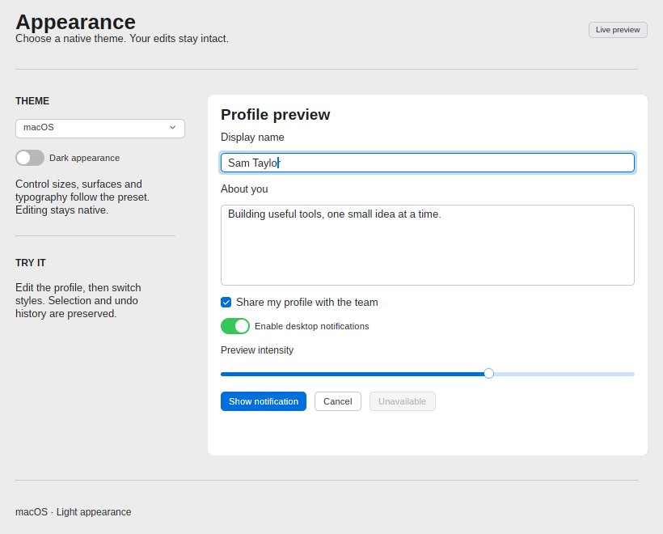
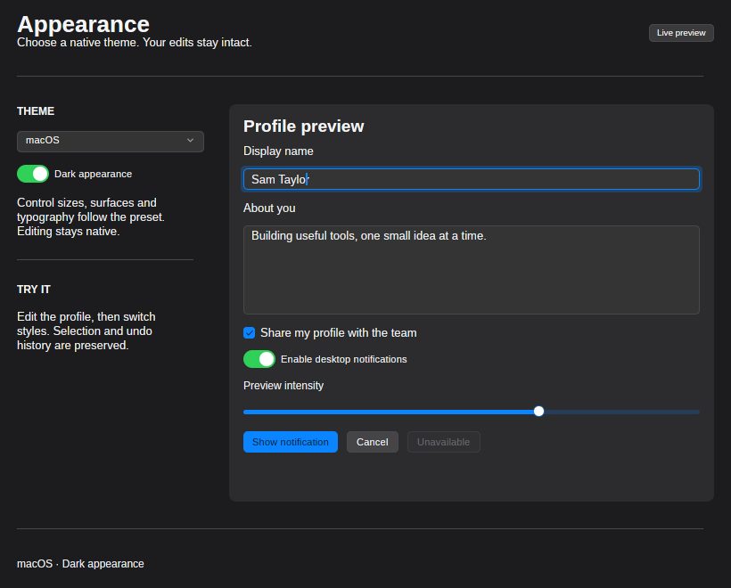
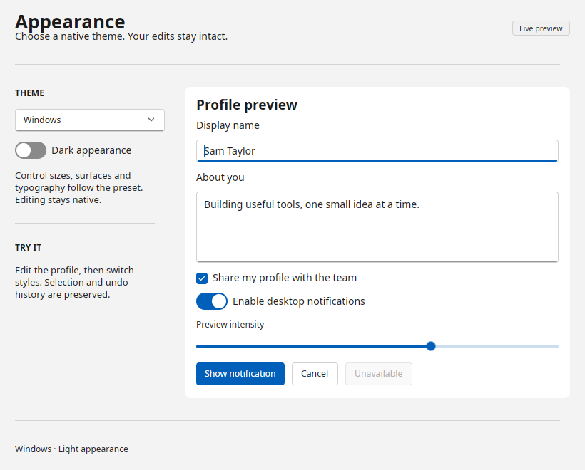
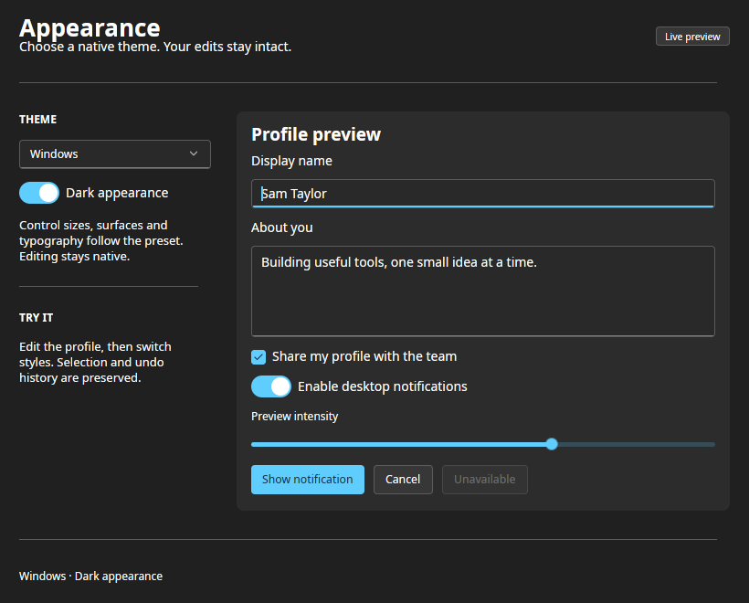
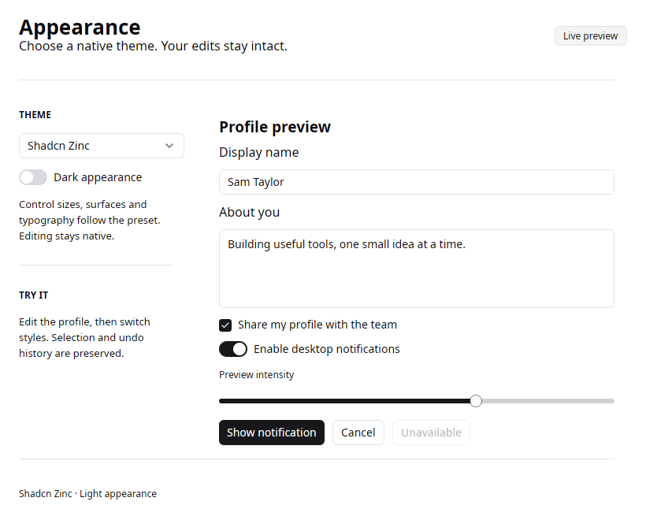
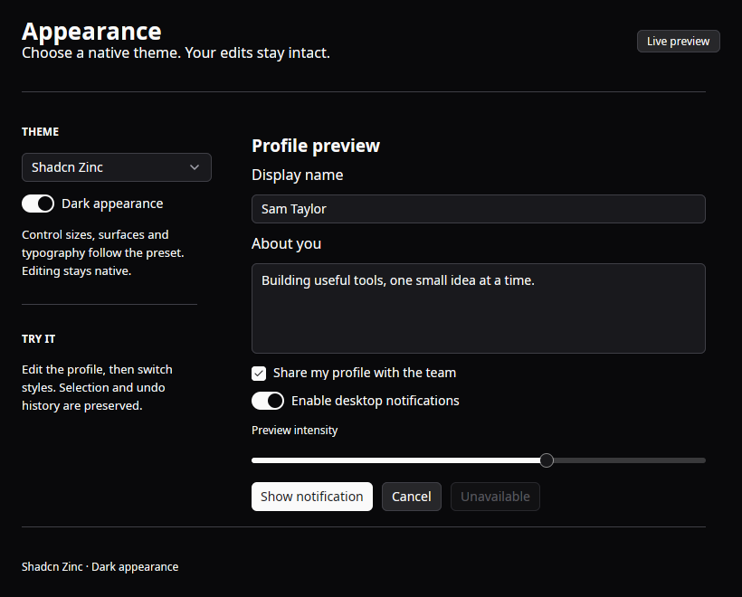
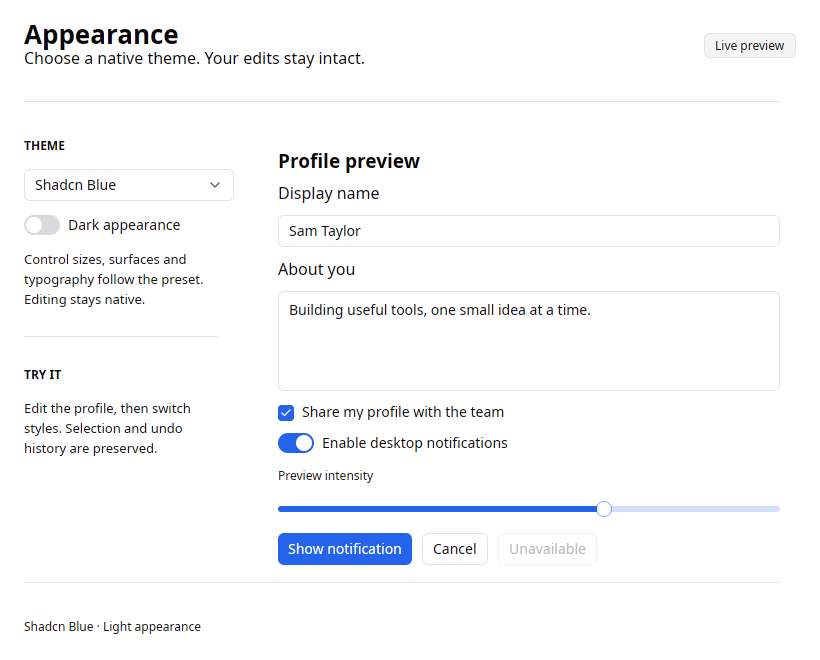
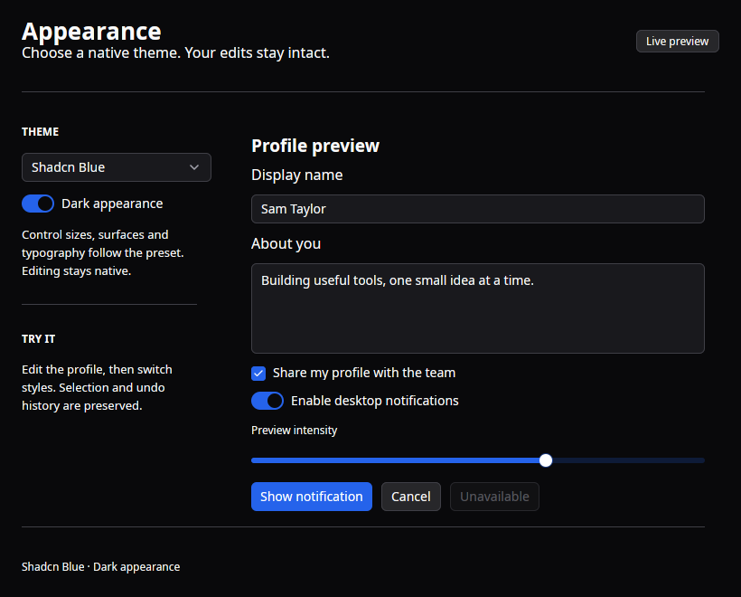

# Native themes

Use macOS-inspired or Windows/Fluent-inspired styling on any supported desktop.
Both have light and dark palettes. Shadcn-inspired Zinc and Blue presets provide
neutral alternatives, and every preset accepts custom colors and typography.
These theme real GPUI Kit controls; window decorations remain platform-owned.

```python
from gpyui import Application, Button, Column, Label, TextInput, Theme

app = Application(title="Profile", theme=Theme("macos"))
with app, Column().style(gap=12):
    Label("Display name")
    name = TextInput("Sam Taylor")
    Button("Save", variant="primary", on_click=lambda: app.notify(f"Hello, {name.value}"))
app.run()
```

Use `Theme("windows", mode="dark")` for the dark Windows preset. The short forms
`Application(theme="macos")` and `Application(theme="windows")` select light
appearance. Existing `theme="light"` and `theme="dark"` select Kit's default theme.

## Presets

| Preset | Look | Base text | Control / overlay radius |
| --- | --- | ---: | ---: |
| `default` | GPUI Kit's original light/dark palette | 16 px | 6 / 8 px |
| `macos` | Compact controls, gray chrome, white fields, green switches | 13 px | 5 / 10 px |
| `windows` | Roomier Fluent controls, underlined fields, blue/cyan switches | 14 px | 4 / 8 px |
| `shadcn-zinc` | Neutral Zinc surfaces and contrasting primary actions | 16 px | 6 / 8 px |
| `shadcn-blue` | Zinc surfaces with a blue primary action | 16 px | 6 / 8 px |

The refined platform treatments are available in the repository after 0.4.0.
macOS buttons and single-line fields use 24 px frames; Windows uses 32 px.
Windows checkboxes and switches are larger, its slider thumb uses the accent,
and its editor focus is an accent underline. macOS fields use a soft focus halo,
white slider thumbs and the system green toggle. The same retained Kit controls
and native editing entities render both treatments. Other component families
continue to use the preset's shared colors and radii; theme selection does not
change application-owned layout spacing.

Fonts prefer the matching installed family: the system font on macOS, SF Pro
Text/Helvetica Neue/Inter for the macOS preset elsewhere, and Segoe UI Variable
Text/Segoe UI for Windows. Installed open fonts and Kit's system default are
fallbacks. Explicit `font_family` always wins. No proprietary fonts are bundled.
The macOS and Windows presets are inspired styles, not AppKit/WinUI controls or
pixel-identical operating-system replicas. Native title bars, system menus,
vibrancy and Mica are not replaced by theme colors.

### macOS-inspired

=== "Light"

    

=== "Dark"

    

### Windows/Fluent-inspired

=== "Light"

    

=== "Dark"

    

### Shadcn-inspired

=== "Zinc light"

    

=== "Zinc dark"

    

=== "Blue light"

    

=== "Blue dark"

    

These are real Linux/X11 captures of the same Python example. The documentation
site's appearance toggle changes the website; it does not change captured PNGs.
The macOS/Windows previews focus the display-name editor to show the halo versus
underline treatment; the Python tree and editing controls are the same.

## Customize a preset

```python
from gpyui import Application, Button, Column, Label, Theme

brand = Theme("shadcn-zinc", colors={
    "primary": "#7c3aed",
    "primary_foreground": "#ffffff",
    "background": "#faf9ff",
}, radius=8, radius_lg=12, font_size=15, shadow=False)

app = Application(theme=brand)
with app, Column().style(gap=12):
    Label("A custom native palette")
    Button("Continue", variant="primary")
app.run()
```

`Theme` is immutable and copies the supplied color mapping. `.colors` exposes a
read-only mapping of explicit overrides. `brand.customize(mode="dark", radius=6)`
returns a new theme; `customize(colors={...})` merges explicit overrides. Explicit
colors also carry across mode changes, so choose foreground/surface pairs that
work in the intended appearance or define separate light/dark overrides.

| Option | Contract |
| --- | --- |
| `preset` | One of the five names above; default `default` |
| `mode` | `light` (default) or `dark` |
| `colors` | Mapping of accepted tokens to `#RRGGBB` or `#RRGGBBAA` |
| `radius`, `radius_lg` | Integer 0–64 pixels; omitted values use preset defaults |
| `font_size` | Finite number 8–48 pixels; omitted value uses preset default |
| `font_family` | Installed font family, or `None` for preset font selection / Kit fallback |
| `mono_font_size` | Finite number 8–48 pixels; default 13 |
| `mono_font_family` | Installed monospace family, or `None` for Kit's platform default/fallback |
| `shadow` | Boolean; default `True` |

Accepted color tokens:

- Surfaces/text: `background`, `foreground`, `muted`, `muted_foreground`,
  `secondary`, `secondary_foreground`, `accent`, `accent_foreground`.
- Brand and states: `primary`, `primary_foreground`, `primary_hover`, `primary_active`.
- Status: `danger`, `danger_foreground`, `success`, `warning`, `info`.
- Editing: `border`, `input` (input border), `ring`, `selection`, `caret`.
- Components: `button`, `button_hover`, `button_active`, `popover`, `sidebar`.
- Control treatment: `control_background` (TextInput, TextArea and Select surface),
  `switch` (off track), `switch_thumb`, `switch_checked` (on track),
  `slider` (filled track), `slider_thumb`.

For example, `Theme("macos", colors={"switch_checked": "#248a3d"})` overrides
its green toggle independently from blue primary actions. Windows toggles and
slider thumbs follow an overridden primary unless explicitly customized; the
macOS toggle remains green and its slider thumb remains white.

When overriding `primary`, Kit derives hover, active, ring and caret colors unless
you explicitly override those tokens; selection uses the new color at 20% opacity.
An overridden border also becomes the default input border. Colors omitted by the
preset fall back through Kit's native component theme configuration.
Use `.style(color="primary", background="muted")` on controls as before;
raw hex colors belong in `Theme`, not `.style(...)`. Use `background="popover"`
for a raised content surface and `background="sidebar"` for a navigation pane.

## Switch a running window

Assign `app.theme` from a callback, with a string or immutable `Theme`. Theme
updates coalesce within `app.batch()` and apply on the GPUI foreground thread.

```python
from gpyui import Application, Button, Column, Label, TextInput, Theme

app = Application(theme=Theme("macos"))

def toggle_appearance():
    app.theme = app.theme.customize(mode="dark" if app.theme.mode == "light" else "light")

with app, Column().style(gap=12):
    Label("Your edits stay here")
    TextInput("Try selecting some text")
    Button("Toggle appearance", on_click=toggle_appearance)
app.run()
```

Theme changes refresh native styling without reconstructing controls or setting
their values. Caret, selection and undo history stay native. Explicit per-control
styles such as `radius=12` or `font_size=20` continue to override inherited values.
Use `app.call_soon()` for theme requests from external Python threads.

`app.theme` is the requested theme. `await app.theme_snapshot()` flushes pending
updates and returns the applied native configuration: `name`, `mode`, radius/font
settings, `shadow`, resolved `colors` (including control surface, switch and slider tokens),
and the synchronized `base` background,
primary and radius. It is a state barrier, not a GPU presentation barrier.

## Run the appearance example

```bash
uv run python examples/appearance.py --theme macos --mode light
uv run python examples/appearance.py --theme windows --mode dark
```

The [example source](https://github.com/gtrefalt/gpyui/blob/main/examples/appearance.py)
switches styles live, keeps the same profile editors, and shows native buttons,
select, switches, checkbox, slider, tag and notification. Reproduce the PNGs on an
X11 desktop with `uv run python scripts/capture-themes.py`.

Implementation: [Python themes](https://github.com/gtrefalt/gpyui/blob/main/src/gpyui/themes.py)
and [native translation](https://github.com/gtrefalt/gpyui/blob/main/src/theme.rs).
The [source-grounded plan](../plans/native-themes.md) records the upstream APIs.
