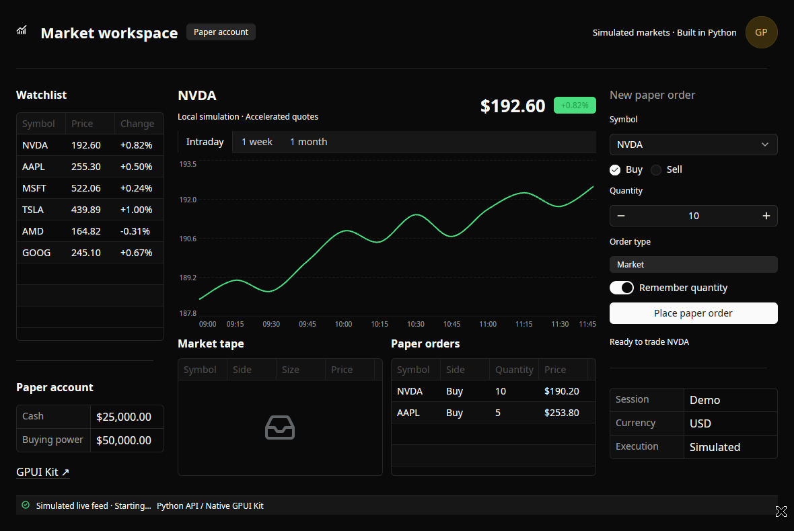

# Native interfaces. Python apps.

**gpyui** brings Longbridge's [GPUI Kit](https://gpui-kit.com/) to Python through
a PyO3 extension. Compose your desktop app, bind application state and handle
events in Python. [GPUI](https://www.gpui.rs/) and Kit retain the native window,
rendering, focus, editing and component state in Rust.

[Build your first app](guide/install.md){ .md-button .md-button--primary }
[Explore 77 components](components/index.md){ .md-button }



This is a real native window, recorded on Linux. The [trading example](examples/trading.md)
streams simulated quotes and trades, fills paper orders through async Python
callbacks, and updates native charts and tables.

## Write the app in Python

```python
from gpyui import Application, Button, Column, Label, TextInput

app = Application(title="Hello", width=480, height=300)
with app, Column():
    name = TextInput(placeholder="Your name")
    greeting = Label("Choose Greet")
    Button("Greet", on_click=lambda: setattr(greeting, "text", f"Hello, {name.value}!"))
app.run()
```

## Native appearance

Use Kit’s macOS Classic, Windows/Fluent and shadcn-inspired light/dark presets, or customize a
semantic palette. Switch themes without losing editor state. Explore the
[theme previews and live example](guide/themes.md).

## Explore the library

| Start here | What you can build |
| --- | --- |
| [Layouts](components/layout/index.md) | Columns, rows, surfaces, scrolling and native resizable panes |
| [Inputs](components/inputs/index.md) and [selection](components/selection/index.md) | Native text editing, choice controls, searchable dropdowns and bindings |
| [Data](components/data/index.md) and [charts](components/charts/index.md) | Native tables, trees and five plot families |
| [Overlays](components/overlays/index.md) | Native dialogs, sheets, popups and hover content |
| [Content](components/content/index.md) and [feedback](components/feedback/index.md) | Native rich text, messages, status and progress |

Every catalog entry includes a real native preview, properties and a runnable
Python example. The documentation search indexes all component names.

!!! note "Current scope"

    gpyui is in early development with 77 controls on `main` and native notifications.
    Version 0.6.1 includes Image, expanded window controls, exact macOS Classic
    themes, keyed tables, richer inputs, MultiSelect and CommandPalette.
    Basic catalog coverage does not imply full Kit parity. The backend uses
    Kit 0.7.1 / GPUI 0.3.8.
    Table uses native virtualization; List currently renders all items. Linux/X11 is
    tested, and macOS/Windows wheels have native smoke tests. One window and
    dynamic children and visibility are supported, preserving native editing state. The package is
    [available on PyPI](https://pypi.org/project/gpyui/) and licensed under MIT.
    [Coverage](component-coverage.md) lists the remaining specialized Kit APIs.

## Sources and evidence

The architecture was checked against the implementations of NiceGUI, Flet, GPUI
and GPUI Kit. Read the [source-grounded decisions](architecture.md),
[pinned revisions](upstream-lock.json) and [native validation](validation.md).

[Repository](https://github.com/gtrefalt/gpyui) ·
[GPUI source](https://github.com/zed-industries/zed/tree/main/crates/gpui) ·
[GPUI Kit source](https://github.com/longbridge/gpui-kit)
